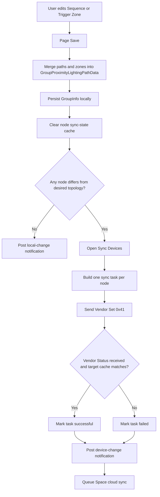

# Path Sequence：Sequence 与 Trigger Zone 功能及协议教学分析

## 1. 文档目的

本文面向第一次接触 SunSmart Path Sequence、Proximity Lighting 和 Bluetooth Mesh 的开发、测试及培训人员，回答以下问题：

1. `Sequence` 和 `Trigger zone` 分别表达什么业务关系。
2. App 最终给设备发送什么命令。
3. 哪些是 Bluetooth SIG Mesh 标准消息，哪些是 Sunricher 私有 Vendor 消息。
4. 保存、下发、应答和失败重试的完整流程。
5. Sequence 和 Trigger Zone 是否会同步到服务器。
6. 当前设备同步与服务器同步实现是否正确，有哪些边界风险。

本文结论基于 2026-07-28 当前源码静态分析、当前工程实际引用的本地 `NordicSigMeshSDK`，以及以下私有协议文档：

`/Users/maginawin/Desktop/Obsidian/Apps/SunSmart/_protocols/sunricher_protocol_vendor.md`

本轮没有修改业务代码，也没有进行真实设备或真实服务器联调。

---

## 2. 先给结论

### 2.1 最核心的结论

`Sequence` 和 `Trigger zone` 是 App 侧用于编辑拓扑的两种业务表达，但设备侧并不保存 “Sequence 1”“Zone 1” 这样的对象。

保存时，App 会把两种业务结构统一换算成：

> 每个设备应该保存哪些 Proximity Lighting 邻居地址。

然后逐个节点下发 Sunricher 私有的 `PROXIMITY LIGHT` Vendor 命令。

### 2.2 两者如何换算

- `Sequence`：一个设备只把序列中紧邻自己的前一个、后一个设备视为直接邻居。
- `Trigger zone`：同一个 Zone 内的设备彼此互为邻居，即形成一个全连接关系。
- 同一设备同时出现在 Sequence 和 Trigger Zone 时，App 会对两边产生的邻居地址取并集并去重。

示例：

```text
Sequence: A — B — C — D
```

得到的直接邻居：

| Device | Direct neighbors |
| --- | --- |
| A | B |
| B | A, C |
| C | B, D |
| D | C |

```text
Trigger Zone: A, C, D
```

得到的直接邻居：

| Device | Direct neighbors |
| --- | --- |
| A | C, D |
| C | A, D |
| D | A, C |

如果两种配置同时存在，A 的最终邻居是 `B, C, D`。

### 2.3 协议分类

| 场景 | 消息 | 类型 |
| --- | --- | --- |
| 保存邻居表 | Vendor Set `0xF0 / 0x41 / 0x02` | Sunricher 私有 |
| 单独启用或禁用 Proximity Lighting | Vendor Set `0xF0 / 0x41 / 0x01` | Sunricher 私有 |
| 单独修改中继深度 | Vendor Set `0xF0 / 0x41 / 0x03` | Sunricher 私有 |
| 设备运行时传播 PIR 触发 | Vendor Set `0xF0 / 0x41 / 0x00`，另兼容 `0x04` 上行反馈 | Sunricher 私有 |
| App 在 Quick Add/Trigger Add 中接收 Presence Detected | Sensor Status `0x52` | SIG Mesh 标准 |
| App 识别设备 | Health Attention Set Unacknowledged `0x8006` | SIG Mesh 标准 |
| Path/Zone 测试时先关闭组 | Generic OnOff Set Unacknowledged `0x8203` | SIG Mesh 标准 |
| Path/Zone 测试时逐灯点亮 | Light Lightness Set Unacknowledged `0x824D` | SIG Mesh 标准 |

因此，准确说法是：

> Sequence 和 Trigger Zone 的正式设备配置使用私有 Vendor 协议；页面的采集、识别、测试等辅助功能同时使用 SIG Mesh 标准协议。

---

## 3. 功能入口与作用范围

### 3.1 Group Path Sequence 页面

组的 Profile 为以下任意一种时可使用该能力：

- `proximityLighting`
- `proximityLightingWithPhotocell`

组页面通过 `GroupPathSequencePageController` 打开 Path Sequence 页面，其中包含两个 Tab：

- `Sequence`
- `Trigger zone`

两个 Tab 共用一个 `GroupProximityLightingPathData`：

- `paths` 保存 Sequence。
- `zones` 保存 Trigger Zone。

源码证据：

- 页面入口：`SunSmart/Main/Group/Controller/GroupViewController.swift:1487-1492`
- 两个 Tab：`SunSmart/Main/Group/Path/Controller/GroupPathSequencePageController.swift:13-25`
- 共用数据模型：`SunSmart/Main/Group/Model/GroupProximityLightingData.swift:11-20`

### 3.2 另一个同名但不同作用域的 Space Trigger Zone

工程还存在 `SpacePathTriggerZoneController`，它允许跨多个 Proximity Lighting Group 建立 Space 级 Trigger Zone。

它不是 Group Path Sequence 页中的 Trigger Zone Tab：

| 项目 | Group Trigger Zone | Space Trigger Zone |
| --- | --- | --- |
| Controller | `GroupPathSequenceTriggerZoneController` | `SpacePathTriggerZoneController` |
| 数据归属 | `group.info.proximityLightingPath.zones` | `space.triggerZones` |
| 设备范围 | 单个 Group | Space 内多个符合条件的 Group |
| 当前正常 UI 入口 | 已启用 | 代码存在，但 More 列表未正式加入入口 |

本文以 Group Path Sequence 页面为主，同时审计 Space Trigger Zone，是因为两者最终会写入同一份设备邻居表，存在互相覆盖风险。

---

## 4. 从业务模型理解 Sequence

### 4.1 App 保存什么

每条 Sequence 是一个有顺序的 Point 列表：

- 每个 Point 可以为空。
- 也可以绑定一个设备的 Vendor Model 所在元素地址。
- 最多 32 条 Sequence。
- 每条最多 200 个 Point。

源码证据：

`SunSmart/Main/Group/Model/GroupProximityLightingData.swift:97-178`

### 4.2 空 Point 的含义

空 Point 在 App 和服务器中会保留位置：

- App 模型使用 `address = nil`。
- 上传服务器时编码为地址 `0`。
- 从服务器导入时，地址 `0` 恢复成空 Point。

空 Point 会中断直接邻居关系。例如：

```text
A — empty — B
```

A 和 B 不会成为直接邻居，因为当前代码只读取相邻的前一个和后一个 Point，不会跨越空 Point 查找。

服务器导入证据：

`SunSmart/Common/Data/ImportData.swift:1555-1573`

### 4.3 Sequence 如何生成设备邻居

对 Group 内每个节点执行以下计算：

1. 遍历所有 Sequence。
2. 找到当前节点在该 Sequence 中的位置。
3. 如果前一个 Point 有有效设备，将其加入邻居。
4. 如果后一个 Point 有有效设备，将其加入邻居。
5. 地址必须属于当前 Group。
6. 重复地址只保留一次。

源码证据：

`SunSmart/Common/Data/Node+SyncData.swift:1623-1658`

### 4.4 `relay` 不是“直接邻居数量”

私有命令中的 `relay` 来自 Group Profile 的 `proximityLightingNumber`。

Sequence 仍只配置前后直接相邻节点；设备收到触发后，根据 `relay` 决定触发继续向多少层邻居传播。可以把它理解为传播深度，而不是 App 直接塞入邻居表的设备数量。

---

## 5. 从业务模型理解 Trigger Zone

### 5.1 Group Trigger Zone 保存什么

每个 Zone 保存一个无顺序的设备地址数组：

- 最多 32 个 Zone。
- Zone 内地址本身没有顺序语义。
- 当前模型没有定义每个 Zone 的最大设备数量。

源码证据：

`SunSmart/Main/Group/Model/GroupProximityLightingData.swift:183-213`

### 5.2 Trigger Zone 如何生成设备邻居

如果当前节点属于某个 Zone：

1. 复制该 Zone 的地址列表。
2. 移除当前节点自己。
3. 过滤掉不属于当前 Group 的地址。
4. 将其余地址全部加入邻居。
5. 与其他 Zone、Sequence 产生的邻居合并并去重。

源码证据：

`SunSmart/Common/Data/Node+SyncData.swift:1660-1667`

所以 Trigger Zone 的设备侧结果是一个邻接关系，不是单独的 Zone 配置表。

### 5.3 一个重要认知

同一个 Zone 内有 N 个设备时，每个设备都需要保存另外 N-1 个地址。

例如 Zone 为 `A, B, C, D`：

- A 保存 B、C、D。
- B 保存 A、C、D。
- C 保存 A、B、D。
- D 保存 A、B、C。

设备不会收到 `zoneId = 1`，也不会收到整个 App Zone JSON。

---

## 6. 私有协议详解

### 6.1 Vendor Access Opcode

当前 SDK 定义：

- Vendor Set：`0xF0780A`
- Vendor Status：`0xF3780A`
- Company ID：`0x0A78`

SDK 用一个 `UInt32` 表示完整 Vendor opcode，所以源码看到的是 `0xF0780A`。从业务协议角度通常写成：

```text
Vendor SET opcode 0xF0 + Company ID 0x0A78
```

源码证据：

- `SunricherVendorSet.swift:10-15`
- `SunricherVendorStatus.swift:10-13`

当前工程四个品牌 Target 都引用本地 SDK：

`/Users/maginawin/Developer/iOS/YKH/nordic-sig-mesh-sdk`

### 6.2 0x41 主功能码

`0x41` 表示 `PROXIMITY LIGHT`。

| Subcode | 名称 | App 使用目的 |
| --- | --- | --- |
| `0x00` | Trigger | 设备运行时传播 PIR 触发 |
| `0x01` | Enabled | 启用或禁用 Proximity Lighting |
| `0x02` | Neighbor Set | 写入邻居表、启用状态、relay、TTL 和转发 AppKey Index |
| `0x03` | Relay Set | 只更新 relay |
| `0x04` | Other Trigger / origin feedback | 设备主动上行源地址反馈，App 也按触发事件处理 |

私有协议文档证据：

- SET：`sunricher_protocol_vendor.md:275-287`
- RET：`sunricher_protocol_vendor.md:826-837`

SDK 枚举证据：

`SunricherVendorStatus.swift:1240-1252`

### 6.3 0x41/0x02：完整邻居配置

这是 Sequence 和 Trigger Zone 保存时最主要的设备命令。

Access Parameters：

| Offset | Length | Field |
| --- | ---: | --- |
| 0 | 1 | Main code = `0x41` |
| 1 | 1 | Subcode = `0x02` |
| 2 | 2 | Relay AppKey Index，U16，小端 |
| 4 | 1 | Enabled，当前 App 写 `1` |
| 5 | 1 | Relay |
| 6 | 1 | TTL，当前页面同步写 `0` |
| 7 | 1 | Neighbor count |
| 8 | 2 × N | Neighbor addresses，逐个 U16 小端 |

可概括为：

```text
41 02 app_idx_le enable relay ttl count addr_1_le addr_2_le ...
```

当前 App 构造值：

- `enabled = true`
- `relay = group.info.profile.proximityLightingNumber`
- `ttl = 0`
- `relayAppKeyIndex = currentApplicationKey.index`
- `neighborAddresses = Sequence 与 Trigger Zone 换算后的地址并集`

源码证据：

- App 构造消息：`SunSmart/Main/Space/Model/SyncDevicesCellModel.swift:613-616`
- SDK 编码：`SunricherVendorSet.swift:194-199`

### 6.4 0x41/0x01：启用或禁用

格式：

```text
41 01 enabled
```

App 在以下情况使用：

- 邻居表与 relay 已经正确，但设备当前未启用：发送 `enabled = 1`。
- 节点已经不属于 Proximity Lighting Profile 或退出 Group，但设备仍启用：发送 `enabled = 0`。
- Space Trigger Zone 的目标邻居为空且设备仍启用：发送 `enabled = 0`。

源码证据：

- Group 计算：`SunSmart/Common/Data/Node+SyncData.swift:1601-1611,1672-1679`
- Space 计算：`SunSmart/Main/Space/TriggerZone/Controller/SpacePathTriggerZoneController.swift:372-390`

### 6.5 0x41/0x03：只修改 relay

格式：

```text
41 03 relay
```

当满足以下条件时 App 只发送该命令：

- Proximity Lighting 已启用。
- 设备缓存中的邻居表已经与目标邻居表一致。
- 只有 Profile 的 `proximityLightingNumber` 发生变化。

这样避免重新写整张邻居表。

### 6.6 私有应答

上述 `0x01`、`0x02`、`0x03` 都是 acknowledged Vendor Set。

设备使用 Vendor Status `0xF3 / Company ID 0x0A78` 返回：

```text
41 subcode ret
```

主要状态：

| Subcode | ret | 含义 |
| --- | --- | --- |
| `0x01` | `0` | 启用/禁用成功 |
| `0x02` | `0` | 邻居配置成功 |
| `0x02` | `2` | 邻居资源不足 |
| `0x03` | `0` | relay 设置成功 |

SDK 统一把 `ret == 0` 解析为成功，非 0 解析为失败并保留 `errorCode`。

源码证据：

`SunricherVendorStatus.swift:184-203`

### 6.7 设备状态缓存如何更新

只有收到成功的 Vendor Status 后，SDK 才更新 Node 缓存：

- `proximityLightingEnabled`
- `proximityLightingRelayCount`
- `proximityLightingNeighborAddresses`

源码证据：

`VendorServerDelegate.swift:199-207,350-359`

同步页面完成后又会对照目标值检查 Node 缓存，避免把“成功收到一个不匹配的回包”当作业务同步成功。

---

## 7. SIG Mesh 标准消息在哪里使用

### 7.1 Quick Add 和 Trigger Add

Sequence 与 Trigger Zone 的添加页面会监听两类触发：

1. SIG Sensor Status `0x52`，读取 Device Property `Presence Detected = 0x004D`。
2. Sunricher Vendor Set `0xF0 / 0x41 / 0x00` 或 `0x04`。

收到有效触发后，App 找到对应 Node，再根据当前模式：

- Quick Add：自动填入下一个 Point 或当前 Zone。
- Trigger Add：把设备加入候选列表，等用户确认。

Sequence 证据：

`SunSmart/Main/Group/Path/Controller/GroupPathSequenceViewController.swift:664-739`

Trigger Zone 证据：

`SunSmart/Main/Group/Path/Controller/GroupPathSequenceTriggerZoneController.swift:585-650`

SIG Sensor Status opcode 证据：

`SensorStatus.swift:36-40`

### 7.2 Identify

点击识别设备时使用 SIG Health Model：

```text
Attention Set Unacknowledged, opcode 0x8006
```

默认 `attentionTimer = 5` 秒。

源码证据：

`MeshAPI.swift:982-998`

### 7.3 Path/Zone Test

测试不是在验证设备内部邻居表，而是 App 主动发送灯控消息，按 UI 配置顺序检查灯具位置：

1. 给 Group 地址发送 `Generic OnOff Set Unacknowledged(false)`，关闭全组。
2. 延时 2.5 秒。
3. 每 0.5 秒给下一个设备发送 `Light Lightness Set Unacknowledged(max)`。

对应标准 opcode：

- Generic OnOff Set Unacknowledged：`0x8203`
- Light Lightness Set Unacknowledged：`0x824D`

源码证据：

`SunSmart/Main/Group/Path/View/GroupPathSequencePathTestView.swift:153-177,191-207`

因此这个 Test 只能证明：

- App 保存的地址及顺序与现场灯具大致对应。
- 标准开关和亮度控制能够到达设备。

它不能证明：

- 设备已经成功保存 `0x41/0x02` 邻居表。
- 真实 PIR 触发会沿邻居拓扑传播。
- `relay` 深度行为完全正确。

---

## 8. 保存与发送的完整流程



### 8.1 Page Save

点击右上角 Save 后：

1. 停止当前 Sequence/Zone 编辑状态。
2. 把两个 Tab 的副本写回同一个 `groupPath`。
3. 比较保存前后的完整路径和 Zone 数据。
4. 设置 `group.info.proximityLightingPath`。
5. 写入本地 `GroupInfo` 数据库。
6. 清除 Group 内节点的同步状态缓存。

源码证据：

`SunSmart/Main/Group/Path/Controller/GroupPathSequencePageController.swift:112-139`

### 8.2 差异计算

对每个 Group Node 运行 `getNodeSyncProximityLighting()`。

结果最多返回一个待执行操作：

- `.proximityLightingEnabled`
- `.proximityLightingRelayNumber`
- `.proximityLightingNeighbor`
- `nil`，表示当前缓存与目标一致

选择顺序：

1. Profile 不符合或节点已退出 Group：必要时禁用。
2. 邻居和 relay 都一致：必要时只启用。
3. 邻居一致但 relay 不同：只设置 relay。
4. 其他情况：写完整邻居表。

### 8.3 任务执行

`SyncDevicesViewController` 为每个需要同步的节点创建任务，然后后台逐个执行：

1. 取下一个待处理 Task。
2. 生成 `MeshMessageHandle`。
3. 通过 `MeshProxyMessageCommand` 发送 acknowledged message。
4. 普通任务应答超时为 15 秒。
5. 收到成功应答时，SDK 更新 Node 缓存。
6. 完成回调再次检查：
   - 每个 Message Handle 是否成功。
   - Node 缓存是否与目标 `enabled / relay / neighbors` 一致。
7. 两项都成立才把 Task 标记为成功。

源码证据：

- 创建任务：`SunSmart/Main/Space/Controller/SyncDevicesViewController.swift:651-720`
- 顺序执行：`SunSmart/Main/Space/Controller/SyncDevicesViewController.swift:2294-2394`
- 发送与完成判定：`SunSmart/Main/Space/Controller/SyncDevicesViewController.swift:2517-2651`
- 目标值判定：`SunSmart/Main/Space/Model/SyncDevicesCellModel.swift:379-384`

### 8.4 重试行为

当前普通 Sequence/Trigger Zone Task 没有自动重试：

- 一次超时或失败后标记 Failed。
- 页面通过 `Devices not synced` 提示保留手动重新同步入口。

当前自动 2 次重试策略只为 Emergency Fire 的删除清理任务启用，不适用于 Proximity Lighting。

---

## 9. 服务器同步

### 9.1 Group Sequence 与 Group Trigger Zone 会上传

两者一起保存在每个 Group 的：

```text
proximityLightingPath
  paths
  zones
```

上传格式：

```text
proximityLightingPath:
  paths:
    - items: [address or 0, ...]
  zones:
    - addresses: [address, ...]
```

源码证据：

`SunSmart/Common/Data/ExportData.swift:516-526`

从服务器下载 Space 时，App 会恢复：

- Sequence 的顺序和空 Point。
- Trigger Zone 的地址列表。

源码证据：

`SunSmart/Common/Data/ImportData.swift:1554-1592`

### 9.2 Space Trigger Zone 也会上传

Space 级数据使用单独字段：

```text
triggerZones
```

每个 Item 同时保存：

- `groupAddress`
- `deviceAddress`

源码证据：

- 数据模型：`SunSmart/Main/Space/TriggerZone/Model/SpaceTriggerZone.swift:11-73`
- 导出：`SunSmart/Common/Data/ExportData.swift:163-177`
- 导入：`SunSmart/Common/Data/ImportData.swift:1100-1105`

### 9.3 云端请求流程

本地数据变化通知最终调用：

```text
space.commitLocalChangeForCloudSync(...)
```

它会：

1. 更新 Space 摘要数量。
2. 单调递增 `lastUpdate`，确保 `needUploadCloud = true`。
3. 保存本地 Space。
4. 根据 Site 是否已经上传，排队：
   - `syncSpace`
   - 或 `syncSite + syncSpaces`
5. 导出完整 Space JSON。
6. 调用 `/sitespace/sync/spaceprops` 或 Site 同步接口。
7. 成功后将 `lastUploadCloudTimestamp` 更新为 `lastUpdate`。

源码证据：

- 变更提交：`SunSmart/Main/Space/Controller/SpaceViewController.swift:71-137`
- API 选择：`SunSmart/Common/Cloud/CloudSynchronizationManager.swift:73-88`
- Space API 路径：`SunSmart/Common/Network/NetowrkReqeustApi.swift:250-264`
- 成功时间戳：`SunSmart/Common/Cloud/CloudSynchronizationManager.swift:718-756`

### 9.4 设备同步和服务器同步是两条独立链

需要特别强调：

- Device Sync：把换算后的邻居表写进现场 Mesh 节点。
- Cloud Sync：把 App 的逻辑 Sequence/Zone JSON 上传服务器。

服务器不会替 App 直接发送 Mesh 命令。

设备命令成功不等于服务器同步成功；服务器 HTTP 成功也不等于现场设备配置成功。

---

## 10. 正确性审计

### 10.1 当前主流程正确的部分

### A. Group 页面数据保存结构正确

Sequence 和 Trigger Zone 共同保存到 `GroupProximityLightingPathData`，本地数据库、服务器导出和服务器导入结构相互对应。

### B. 拓扑换算符合当前设计

- Sequence 转为前后直接邻接。
- Trigger Zone 转为同区全连接。
- 两类邻居合并去重。

### C. 设备命令选择具有差量意识

App 不会每次都无条件重写邻居表，而是根据缓存只发送：

- Enable
- Relay Set
- 或 Neighbor Set

### D. 设备同步成功判定不只看“收到了回包”

实现同时检查：

- Vendor Status 是否成功。
- SDK 更新后的 Node 状态是否等于目标值。

这比只判断发送完成或只判断 `ret == 0` 更可靠。

### E. 云端同步包含逻辑结构而不是只有设备邻居缓存

服务器保留 Sequence 的顺序、空 Point 和 Trigger Zone 的分组结构，所以其他 App 下载后仍能重建编辑页面。

### 10.2 需要关注的风险

### Risk 1：Group 与 Space 两套功能会写同一张设备邻居表

这是当前最重要的架构风险。

Group Path Sequence 保存时，目标邻居只根据：

```text
group.info.proximityLightingPath.paths + zones
```

计算。

Space Trigger Zone 保存时，目标邻居只根据：

```text
space.triggerZones
```

计算。

两边都下发相同的 `0x41/0x02` 到相同节点，但都没有合并另一套配置。

结果：

- 保存 Space Trigger Zone 可能覆盖 Group Sequence/Zone 写入的邻居表。
- 之后重新保存 Group Path Sequence 又可能覆盖 Space Trigger Zone。
- 两个服务器字段都可能正确存在，但设备只能保留最后一次下发的邻居表。

因此，在正式启用 Space Trigger Zone 入口前，必须先明确产品真值：

1. Space Trigger Zone 是否替代 Group Trigger Zone。
2. 是否允许与 Sequence 共存。
3. 如果允许共存，应由一个统一的拓扑编译器合并 Group paths、Group zones 和 Space zones，再下发一次目标邻居表。

当前 Space Trigger Zone 尚未正式开放入口，暂时降低了用户侧触发概率，但没有消除代码层冲突。

### Risk 2：Group 保存存在“先本地保存、后标记云同步”的中断窗口

Group 页面先执行 `group.info.save()`，但不会立即直接更新 `space.lastUpdate`。

- 没有设备任务时，会立即发送 `.common` 变更通知。
- 有设备任务时，要等 Sync 页面结束后，由通用 Sync 流发送 `.device` 通知。

如果 App 在本地 GroupInfo 保存后、Sync 流结束通知前异常退出，逻辑配置已经写入本地数据库，但 Space 可能还没有被标记为需要上传。

正常完成页面流程时服务器同步是正确的，但该中断窗口值得收紧。

推荐原则：

> 业务逻辑数据一旦本地提交，应立即标记 Cloud Dirty；设备同步成功与否应作为独立状态管理，不应决定服务器是否知道用户已经修改逻辑配置。

### Risk 3：Space Trigger Zone 清空时没有显式导出空数组

`SpaceData.export()` 只有在 `triggerZones` 非空时才写入字段。

当用户删除所有 Space Trigger Zones 时，上传 JSON 会省略 `triggerZones`，而不是发送：

```text
triggerZones: []
```

能否正确清空服务器旧值，依赖 `/sync/spaceprops` 是“全量替换”还是“字段合并”。

当前 App 导入时，字段缺失会恢复为空数组；但仅从客户端源码无法证明服务器收到省略字段后一定删除旧值。

上线前应使用真实服务器做一次：

1. 上传非空 Trigger Zones。
2. 再删除为 0 个并上传。
3. 从另一客户端重新下载。
4. 确认服务端返回 `[]` 或不再返回旧数据。

更稳妥的客户端契约是清空时显式上传空数组。

### Risk 4：Space Trigger Zone 成功后会产生两次云同步通知

设备同步结束时，`SyncDevicesViewController` 已统一发送 `.device` 通知。

Space Trigger Zone 的 `syncSuccessCallback` 又会在 `didEdit` 时发送 `.common` 通知。

云同步管理器发现同一个 Space 的同步任务时，会取消旧任务并创建新任务。这意味着第二次 `.common` 通知可能：

- 取消刚开始的 promptly 同步。
- 重新以 slow 优先级排队。
- 产生不必要的请求重启。

数据最终仍可上传，但流程冗余且会降低及时性。建议只保留一次能够准确表达本次变更的通知。

### Risk 5：邻居数量与 Mesh Access Payload 缺少上限保护

协议 `neighbor count` 只有一个 U8。

当前 SDK 直接执行：

```text
UInt8(neighborAddresses.count)
```

同时把所有邻居放进一条 Vendor 消息，没有看到：

- 最大邻居数量校验。
- 按设备固件容量限制校验。
- 超长 Payload 分片成多条业务命令的机制。

Group Trigger Zone 模型又没有设备数量上限；Space 最多允许约 300 个设备。

潜在后果：

- 超过 255 时整数转换失败。
- 在更低数量时就可能超过固件邻居资源，收到 `ret = 2`。
- 即使 count 可编码，也可能超过底层可接受的 Access Message 大小。

需要从固件确认“单节点最大邻居数”，并在 UI、拓扑编译和命令编码三层使用同一个限制。

### Risk 6：Space Trigger Zone 可能保留已经不再符合 Profile 的邻居

Space 页面初始化时只清理：

- Node 已不存在。
- Group 已不存在。

它没有清理“Group 仍存在，但 Profile 已经不再是 Proximity Lighting”的 Item。

`desiredNeighborAddresses` 也没有再次过滤每个邻居所属 Group 是否仍符合 Profile。

这样可能把已失去 Proximity Lighting 资格的节点地址继续写给其他节点。

### Risk 7：普通 Proximity Lighting Task 没有自动重试

一次 15 秒超时后任务直接失败，需要用户手动点击重新同步。

这不是协议错误，但在大型 Zone、弱信号或 Proxy 切换环境下会增加人工恢复成本。是否增加有限重试，需要结合固件幂等性和现场日志评估。

---

## 11. 推荐的测试与验收矩阵

### 11.1 纯 Sequence

准备 A、B、C、D 四台设备：

```text
A — B — C — D
```

核对每台设备收到的 `0x41/0x02`：

- A：B
- B：A、C
- C：B、D
- D：C

再逐台触发 PIR，观察私有 `0x41/0x00` 的 origin、relay 和传播范围。

### 11.2 Sequence 含空 Point

```text
A — empty — B
```

确认 A 与 B 不会被配置为直接邻居。

### 11.3 单个 Trigger Zone

Zone 为 A、B、C：

- A：B、C
- B：A、C
- C：A、B

### 11.4 Sequence 与 Trigger Zone 合并

Sequence 为 A—B—C，Zone 为 A、C：

- A：B、C
- B：A、C
- C：B、A

确认无重复地址。

### 11.5 删除全部 Group Path/Zone

确认当前产品预期是：

- 保持 Proximity Lighting enabled 但邻居为空。
- 还是应禁用 Proximity Lighting。

当前 Group 逻辑倾向于保持或重新启用；Space Trigger Zone 逻辑则在邻居为空时禁用，两者语义不一致，需要产品和固件共同确认。

### 11.6 服务器 Round Trip

1. 配置含空 Point 的 Sequence。
2. 配置多个 Group Trigger Zones。
3. 等待 Cloud Sync 成功。
4. 使用另一客户端或清理本地缓存后重新下载。
5. 检查顺序、空 Point、Zone 地址是否完全一致。
6. 删除全部配置并再次下载，验证服务器清空语义。

### 11.7 故障场景

- `0x41/0x02 ret = 2`。
- 15 秒无应答。
- 同步一半时切换 Proxy。
- 同步一半时退出 App。
- 本地保存成功但没有完成设备同步。
- 服务器上传失败后重试。

---

## 12. 教授他人时建议采用的讲解顺序

### 第一课：先讲图，不讲协议

1. Sequence 是链。
2. Trigger Zone 是团。
3. 设备最终只知道自己的邻居。
4. App 是“拓扑编译器”。

### 第二课：讲设备命令

1. Vendor Set 与 Company ID。
2. `0x41` 主功能码。
3. `0x01 / 0x02 / 0x03` 三种配置命令。
4. `0x00 / 0x04` 运行时触发。
5. Vendor Status 和 `ret`。

### 第三课：讲辅助 SIG 标准协议

1. Sensor Status 用于发现 PIR 触发。
2. Health Attention 用于 Identify。
3. Generic OnOff 和 Light Lightness 用于 Test。
4. 强调 Test 不等于真实 Proximity Lighting 验收。

### 第四课：讲两条同步链

1. App logical model → Cloud JSON。
2. App topology compiler → Per-node neighbor table → Mesh device。
3. 任何一条成功都不能代表另一条成功。

### 第五课：讲当前风险

重点讲：

1. Group 与 Space 配置覆盖。
2. Cloud Dirty 标记时机。
3. 空数组删除语义。
4. 邻居容量上限。

---

## 13. 一句话记忆

> Sequence 决定“前后是谁”，Trigger Zone 决定“同区还有谁”；App 把两者编译成每台设备的邻居表，再用 Sunricher `0x41` 私有协议逐台写入。逻辑结构同步到服务器，邻居表同步到设备，这两条链必须分别验收。

---

## 14. 本轮验证边界

已完成：

- Group Path Sequence 页面入口、模型、保存逻辑静态追踪。
- Sequence 与 Trigger Zone 邻居换算静态追踪。
- 当前本地 Nordic SDK 的 Vendor opcode、payload 和 response 解析核对。
- Sync Devices 任务创建、发送、应答、缓存更新和成功判定追踪。
- 本地数据库、服务器导出、服务器导入和云同步排队追踪。
- `git diff --check` 与工作区状态检查。

未完成：

- 真实设备抓包。
- `ret = 2` 固件容量实测。
- PIR 实际多跳传播验证。
- 真实服务器清空数组 Round Trip。
- Group 与 Space 两套配置交替保存的真机覆盖验证。

因此本文对“当前代码如何工作”的结论是源码级确认；对真实固件容量、服务器字段替换语义和现场无线可靠性，仍需专项联调确认。
