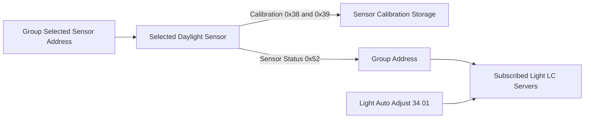
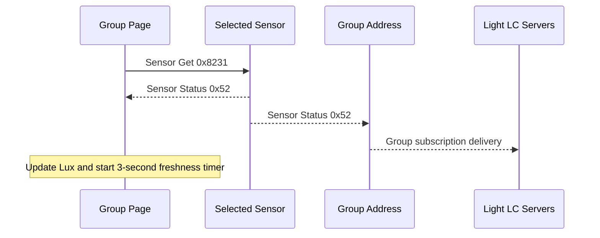
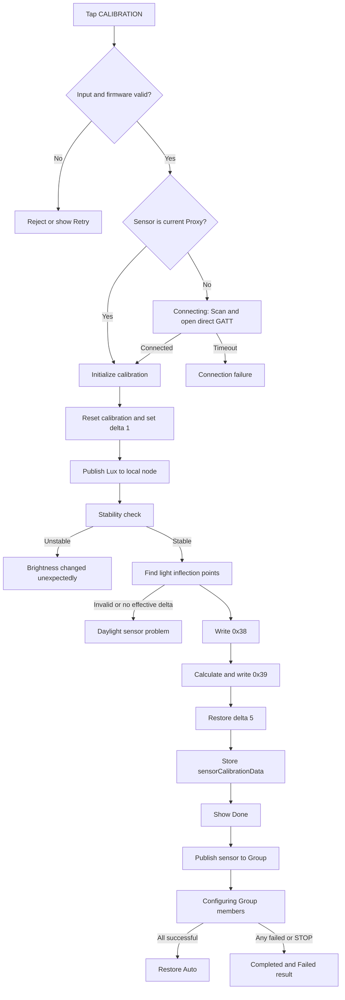

# Group Daylight Calibration 全流程源码调查

> 调查日期：2026-08-19  
> 调查范围：`new-calibration` worktree 的 App 源码，以及工程当前本地引用的 `NordicSigMeshSDK`  
> SDK 状态：本地路径 `/Users/maginawin/Developer/iOS/YKH/nordic-sig-mesh-sdk`，分支 `timezone`，提交 `5dad2d9`  
> 验证方式：静态源码追踪；未进行真机、固件抓包、实际 Lux 计量或多品牌 target 构建

## 1. 结论摘要

是的，以下 3 个 Group Profile 都会进入同一套 daylight sensor 选择、校准、Lux 展示和 daylight 自动调光配置流程：

1. `Occupancy sensing with daylight harvesting`
2. `Vacancy sensing with daylight harvesting`
3. `Daylight harvesting (Closed loop)`

三者对 daylight 的核心实现相同，差异主要在 occupancy、manual control 等附加 profile 配置：

| Profile | 主要设备要求 | Daylight 校准入口 |
| --- | --- | --- |
| Occupancy sensing with daylight harvesting | Luminaire、Light Sensor、Occupancy Sensor | 有 |
| Vacancy sensing with daylight harvesting | Luminaire、Light Sensor、Occupancy Sensor、Manual Control | 有 |
| Daylight harvesting (Closed loop) | Luminaire、Light Sensor | 有 |

整个功能必须分成 4 个层次理解：

1. **传感器校准参数**：`0x38`、`0x39` 只写入当前选中的 daylight sensor，并缓存在该 Node 上。
2. **数据源选择**：Group 只保存一个选中传感器的 Node 单播地址。
3. **Lux 路由**：通过 `Config Model Publication Set`，让选中传感器的 Sensor Server 向 Group 地址发布 `Sensor Status`。
4. **灯具消费 Lux**：组内灯具订阅 Group，并通过 Light LC 与 Vendor `Light Auto Adjust` 配置使用该 Lux。

因此，“传感器已有校准数据”“Group 已选择该传感器”“传感器正在向 Group 发布”“组内灯具已配置成功”是 4 个不同事实，不能用一个绿色标志或一次 `Done` 提示代替全部判断。

## 2. 如何判断 Group 需要校准

### 2.1 当前页面自动提示校准的条件

Group 页面在以下条件同时成立时，自动弹出 daylight calibration 提示：

- 当前 Profile 是上述 3 种之一；
- Group 内至少存在一个带 Ambient Light Sensor Model 的设备；
- 当前用户有编辑权限；
- 并且满足以下任一项：
  - Group 没有保存已选 daylight sensor 地址；
  - 已选传感器的 `sensorCalibrated == false`。

其中 `sensorCalibrated` 的兼容判断为：

- 旧版 `daylightCalibrationValue` 有效；或
- 新版 `sensorCalibrationData` 的以下字段全部存在：
  - `sensorRatio`
  - `ambientlightRatio`
  - `minLightness`
  - `minLux`
  - `maxLux`

### 2.2 此判断没有覆盖的运行条件

当前“需要校准”判断**不会**检查：

- 已选传感器当前是否在线；
- 已选 Sensor Server 是否仍向这个 Group 发布；
- Group 成员的 Light LC / Sensor Server 订阅是否完整；
- 每个灯具的 `Light Auto Adjust` 是否已成功开启；
- 上一次 Configuring 是否全部成功；
- 传感器的 firmware 是否仍满足当前校准版本要求。

所以可能出现：页面不再提示校准，但实际 Lux 路由或组内自动调光配置并未完整建立。

建议产品层面将状态拆成：

| 状态 | 建议判据 |
| --- | --- |
| Sensor calibrated | 传感器本地校准数据完整 |
| Sensor selected | Group 保存的地址能解析到该 Node |
| Sensor routed | Ambient Sensor Server Publication 指向当前 Group |
| Group configured | 所有应配置灯具的 profile 同步命令成功 |
| Runtime healthy | 能持续收到选中传感器发往 Group 的有效 Lux |

## 3. Group 如何记录 daylight sensor

### 3.1 数据归属

Group 使用 `GroupInfo.ambientLightSensorNodeAddress` 保存选中传感器的 Node 单播地址；`ambientLightSensorNode` 再从当前 Mesh 网络的真实 Node 列表中解析该地址。

该地址会：

- 保存到 SQLite 的 `daylightSensorAddress`；
- 随导出数据写出；
- 从导入数据恢复。

校准结果则保存在选中 Node 的 `sensorCalibrationData` 中，并单独持久化。它不是 Group 属性，也不会复制给组内其他设备。

### 3.2 删除或移除 daylight sensor

不同“删除”路径的行为不同：

#### 从 Group 中移除成员

1. App 将设备标记为待退出 Group，并进入同步流程。
2. 对支持新校准数据的节点，还会安排把设备的 daylight ratio 重置为 `100 / 100`。
3. 当真实 Group 的 `Config Model Subscription Delete` 成功、该 Node 已不再属于 Group 后：
   - 如果它正是 Group 保存的 daylight sensor，则清空 `ambientLightSensorNodeAddress`；
   - 保存 Group；
   - 使同步缓存失效。
4. 不会自动选择另一个 daylight sensor。

如果设备离线或退出同步失败，它会保留 `exitFailure` 状态；Group 指针与真实订阅可能仍然存在，不能认为已彻底解除。

#### 从 Mesh/Site 永久删除设备

永久删除 Node 时，App 会立即查找引用它的 Group，清空第一个匹配 Group 的 daylight sensor 地址并保存；不会自动选替代设备。

此路径主要清理本地引用并使同步状态失效，不等价于已向剩余灯具发送 `Light Auto Adjust Off`。仍需后续 Group 同步或重新选择传感器，才能让实际 Mesh 配置收敛。

#### 在 Select daylight sensor 中关闭当前传感器

如果该传感器当前正在向 Group 发布：

1. 发送空 Publication，停止 Sensor Server 向 Group 发布；
2. 成功后清空 Group 保存的 sensor 地址；
3. 重新配置组内灯具，通常会发送 `Light Auto Adjust 34 00`；
4. 传感器自身校准数据不删除，所以绿色校准点仍可能保留。

#### `All devices are offline and cannot be deleted...`

该文案只用于“删除整个 Group”的保护条件：Group 非空且所有设备离线时，不允许删除 Group。它不是 daylight calibration 状态，也不是删除/切换 daylight sensor 时的错误。

## 4. ON 与 OFF Calibration Point LUX

### 4.1 两个值分别代表什么

| 字段 | 用户应在何时测量 | 用途 |
| --- | --- | --- |
| `ON - Calibration Point LUX` | 灯具全开时，在 calibration point 用外部照度计测得 | 表示环境光与灯光共同作用下的参考 Lux |
| `OFF - Calibration Point LUX` | 灯具关闭时，在同一 calibration point 用外部照度计测得 | 表示自然光/环境底光参考 Lux |

页面上的 `ON`、`OFF` 操作会分别向 Group 发送最大亮度或 0 亮度的未确认 Lightness 命令，帮助用户测量；输入框中的值来自外部照度计，不是 App 自动读取的 sensor Lux。

### 4.2 两者如何参与校准

SDK 在校准时还会自己采集传感器侧的：

- `lightOnLux`：Group 全开时传感器报告值；
- `lightOffLux`：Group 关闭时传感器报告值。

然后计算：

- `Ambient light ratio = OFF_meter / OFF_sensor × 100`
- `Sensor ratio = (ON_meter - OFF_meter) / (ON_sensor - OFF_sensor) × 100`

代码会把分母/部分输入至少按 1 处理，并把结果限制在 `0...5000`。

其含义可以概括为：

- OFF 点用于锚定“无灯光时的环境底光”；
- ON 与 OFF 的差值用于比较“灯具带来的照度增量”；
- 所以两个值不是两套独立校准，而是共同解出两个修正倍率。

### 4.3 输入校验

点击 `CALIBRATION` 时要求：

- 两个值都能转换成 `UInt16`；
- `ON > OFF`；
- 选中的 sensor 支持当前校准协议与最低 firmware 版本。

当前实现的注意点：

- 按钮启用只检查“已选择 sensor 且两个字段非空”，不代表数值一定有效；
- 空值、非 `UInt16` 或超范围时会直接返回，没有明确错误提示；
- `ON <= OFF` 才会显示重试提示；
- 本地化说明提到读数应达到目标的 75% 且至少 100 lx，但当前代码没有真正执行这项限制；初始化得到的 `minimumLux` 当前也未参与校验。

## 5. Group 页面底部 Lux 的来源和颜色

### 5.1 数据来源

Lux 来自设备发送的 `Sensor Status`，其中 Property 是 `Present Ambient Light Level`。App 收到后写入 Node 的：

- `lastDaylightLux`：上一次原始值；
- `daylightLux`：当前原始值。

页面显示的是 `steadyDaylightLux`：

- 首次有值时直接使用当前值；
- 后续显示值为 `1% × current + 99% × previous raw`。

这不是持续累积的标准 EMA，因为 `previous` 保存的是上一笔原始值，而不是上一笔平滑结果。其显示会明显偏向上一笔数据。

### 5.2 如何触发更新

1. Group 页面出现时，App 主动向保存的 daylight sensor 发送一次 `Sensor Get`。
2. 校准期间会频繁发送 `Sensor Get` 采样。
3. 正常运行时，已选 sensor 的 Sensor Server 会按配置的 Publication/Delta 规则发布新的 `Sensor Status`。
4. Group 页面只在收到来源地址等于当前已选 sensor 的消息时触发实时刷新。

### 5.3 绿色和灰色的准确含义

| 显示 | 条件 | 含义 |
| --- | --- | --- |
| 绿色背景 | 最近收到一笔符合条件的 Lux，并且 3 秒 freshness timer 尚未超时 | 数据“新鲜”，不是校准成功证明 |
| 灰色背景、有数字 | 已有缓存 Lux，但超过约 3 秒没有新报告 | 数据“陈旧” |
| 灰色背景、空白 | 没有可显示的有效 Lux，或 selected sensor 不满足在线/校准/有值条件 | 当前无有效显示数据 |

还有一个初始化差异：页面首次构建底部 summary 时，会从 sensor 列表里寻找第一个“有 Publication、已校准、有 Lux、在线”的 sensor，并不严格验证它就是 Group 保存的 selected sensor，也没有确认 Publication 的目标就是当前 Group。实时消息更新才严格比较 selected sensor 来源地址。因此在残留/重复配置下，页面初始值可能短暂来自错误 sensor。

## 6. 点击 CALIBRATION 的前置条件

### 6.1 页面层前置条件

- 入口来自 3 个 daylight profile 之一；
- 用户有 Group 编辑权限；
- Group 中至少有可列出的 ambient sensor；
- 当前选择了一个 sensor；
- ON/OFF 输入非空，点击时能转换成 `UInt16`；
- `ON > OFF`；
- sensor 满足 `supportSensorCalibration`：
  - 有 Product ID；
  - 有 Firmware Version；
  - 有 Ambient Sensor Model；
  - 有 Sunricher Vendor Model；
  - Firmware 不低于 Product ID 对应最低版本。

当前最低版本表：

| Product ID | Minimum Firmware |
| --- | --- |
| 1013 | 1.2.33 |
| 1041 | 1.2.26 |
| 1051 | 1.2.16 |
| 其他支持类型 | 1.3.0 |

### 6.2 当前没有提前检查的项目

- Mesh 当前是否已连接；
- sensor 当前在线状态；
- Group 内至少一台灯具在线；
- sensor 是否已经有正确的 Group Publication；
- ON/OFF 页面按钮的未确认亮度命令是否真正生效；
- 外部 Lux 计是否在同一 calibration point；
- 当前是否已经有另一场 calibration 正在执行。

其中部分问题会在后续连接/消息超时中表现为失败，但错误发生得更晚，且错误原因不够具体。

## 7. Calibration 命令与完整流程

### 7.1 主要命令矩阵

| 阶段 | 命令 | Opcode / Payload | 目标 | 预期结果 |
| --- | --- | --- | --- | --- |
| 页面 ON/OFF | Light Lightness Set Unacknowledged | `0x824D` | Group address | 无 ACK；只负责把灯调到最大或 0 |
| 初始化 | Vendor Daylight Calibrate | `0xF0780A`, `31 36 FF FF` | selected sensor Vendor Model element unicast | Vendor Status `0xF3780A` success |
| 初始化倍率 | Vendor Daylight Calibrate Rate | `0xF0780A`, `31 39 64 00 64 00` | selected sensor | Vendor Status success；先恢复 100/100 |
| 校准发布阈值 | Vendor Daylight Publish Delta | `0xF0780A`, `31 37 01 00` | selected sensor | Vendor Status success；将变化阈值设为 1 |
| 临时 Lux 路由 | Config Model Publication Set | `0x03` | selected Ambient Sensor Server | Config Publication Status `0x8019` success；临时发布给本机 Node |
| 采样 | Sensor Get | `0x8231` | selected Ambient Sensor Server | Sensor Status `0x52`，包含 Present Ambient Light Level |
| 灯光扫描 | Light Lightness Set Unacknowledged | `0x824D` | Group address | 无 ACK；依次 0%、25%、50%、75%、95%、细分 5%、100% |
| 写入拐点 | Vendor Daylight Inflection Point | `0xF0780A`, `31 38 ...` | selected sensor | Vendor Status success |
| 写入倍率 | Vendor Daylight Calibrate Rate | `0xF0780A`, `31 39 sensorRatio ambientRatio` | selected sensor | Vendor Status success |
| 恢复发布阈值 | Vendor Daylight Publish Delta | `0xF0780A`, `31 37 05 00` | selected sensor | 设计上应为 Vendor Status success；当前代码没有严格检查 |
| 绑定 Group | Config Model Publication Set | `0x03` | selected Ambient Sensor Server | Publication 目标改为 Group，Status success |
| 配置灯具 | Light LC / Vendor / Config messages | 见 8.2 | 逐个 Group member | 每个节点的全部任务都成功才算该节点 Completed |
| 恢复 Auto | Light LC Light OnOff Set Unacknowledged | `0x829B`, On | Group address | 无 ACK；触发 Group 恢复 Auto |

多字节数值在 payload 中按当前数据编码顺序发送；表格省略了 Model ID、AppKey、TTL、Retransmit 等 Config Publication 参数。

### 7.2 状态机

### 7.3 各阶段细节

#### 1. Connecting

当 selected sensor 不是当前 Proxy Node 时：

1. 暂时把 Mesh transmitter 切换给校准 manager；
2. 扫描 Mesh Proxy Service，并按设备 MAC 匹配 selected sensor；
3. 扫描超时约 15 秒；
4. 找到后直连其 GATT Proxy；连接也有约 15 秒超时；
5. 成功后进入初始化。

如果 selected sensor 已经是当前 Proxy，则跳过此页面状态，直接初始化。

#### 2. Calibrating：初始化

SDK 的 `.ready` 和 `.stabilityChecking` 都在 UI 中显示 `Calibrating`。初始化会：

1. 用 `0x36 / FFFF` 请求开始/重置 daylight calibration；
2. 用 `0x39 / 100,100` 重置两个倍率；
3. 等待约 3 秒；
4. 把 sensor Lux publish delta 临时设为 1；
5. 把 selected Ambient Sensor Server 的 Publication 临时指向本机 Node，便于 App 收集 Lux。

任何必需响应超时或返回失败，通常进入 `noResponse`。

#### 3. Calibrating：稳定性检查

SDK 在约 3 秒内收集 selected sensor 的 Ambient Light Level：

- 最大值与最小值差 `<= 10`：判定稳定；
- 差值 `> 10`：`ambientInstability`；
- 当前代码在完全没有采到样本时也判定“稳定”，随后再依赖 Sensor Get；这是一个异常边界。

#### 4. Calibrating：拐点扫描

1. Group 亮度设为 0，等待约 3 秒，读取 OFF sensor Lux；
2. 依次把 Group 调到 25%、50%、75%、95%；
3. 当传感器 Lux 比 OFF 基线至少增加约 2 lx 时，再以 5% 步进细扫；
4. 如果没有找到明显拐点，则使用 0% OFF 点作为 minimum point；
5. Group 调到最大，等待约 3 秒，读取 ON sensor Lux；
6. 校验 ON sensor Lux 不小于 OFF sensor Lux；
7. 将 minimum lightness、minimum Lux delta、maximum Lux delta 通过 `0x38` 写入 selected sensor。

当前 SDK 虽定义了 `lightsChecking`、`lightInflectionPoints`、`calibrateRate` 等 step，但没有在这些阶段真正赋值，所以 App 当前不会显示 `Checking installation`，这些工作仍显示为 `Calibrating`。

#### 5. Calibrating：倍率计算与保存

1. 要求用户输入的 `ON - OFF > 0`；
2. 要求 sensor 实测的 `ON - OFF > 0`；
3. 计算 Sensor ratio 与 Ambient light ratio；
4. 用 `0x39` 写入 selected sensor；
5. 成功后在该 Node 保存完整 `sensorCalibrationData`；
6. 尝试把 publish delta 恢复为 5。

注意：恢复 publish delta 的回调当前没有严格检查 nil 或 failure status，因此顶层 calibration success 不能证明 `31 37 05 00` 真正写入成功。

#### 6. Calibration 参数成功后的 App 流程

App 收到 SDK success 后，会先显示 `Done`，然后才：

1. 将 selected sensor 的 Publication 改为 Group address；
2. 保存 Group 的 selected sensor 地址；
3. 清空 ON/OFF 输入框；
4. 逐台执行 Group profile Configuring；
5. 全部成功后向 Group 发送未确认的 Auto On 命令。

因此当前 `Done` 的准确含义只是“selected sensor 的 calibration 参数阶段完成”，不是“Group publication、全部灯具配置、Auto 恢复和运行时 Lux 都已验证完成”。

## 8. 状态、成功/失败和后续流程

### 8.1 用户看到的主要状态

| UI 状态/文案 | 实际含义 | 判定条件 | 后续流程 |
| --- | --- | --- | --- |
| `Connecting` | 尝试直连 selected sensor 作为 Proxy | selected sensor 不是当前 Proxy | 成功进入初始化；超时进入连接失败 |
| `Calibrating` | 初始化、稳定性检查、拐点扫描、倍率计算与写入 | SDK `.ready` 或 `.stabilityChecking`；后续 step 未更新仍保持此文案 | 成功保存 Node calibration data；失败进入对应 Retry |
| `Connection failure` | 多类底层失败的共用文案 | `deviceNotsupport` 或 `noResponse`；连接超时/断开也走连接失败 UI | Cancel 或 Retry；连接超时页面可能只给 Close |
| `All devices are offline...` | 整个 Group 删除保护 | 删除 Group，且 Group 非空、所有成员离线 | 阻止 Group 删除；与 Calibration 无关 |
| `There is a problem with the daylight sensor...` | Lux 对灯光变化不符合预期，或拐点/倍率无法成立 | OFF/ON Sensor Get 无结果、ON < OFF、sensor delta 不为正、`0x38/0x39` 失败等 | Cancel 或 Retry |
| `Completed` | Configuring 中整台 Node 的所有待同步任务成功 | 该 Node 所有 message handle 都 `isSuccessful` | 计入成功数，继续下一 Node |
| `Failed` | Configuring 中该 Node 至少一个任务失败或未完成 | 任一 handle 失败/超时，或 STOP 后被归为未完成 | 汇总失败节点，可 Cancel 或 Retry failed nodes |

SDK 定义了 `.disconnect`，App 也有映射，但当前 calibration manager 的 bearer close 回调没有把流程设置为该错误，因此它在现有代码路径中基本不会被主动发出。

### 8.2 Configuring 在做什么

Configuring 不是把 selected sensor 的 `0x38/0x39` 参数复制到每台灯，而是逐台同步每个 Group member 自身的 profile 差异。典型任务包括：

| 任务 | Opcode | 作用 |
| --- | --- | --- |
| Config Model Publication Set | `0x03` | 对需要的 Sensor/Presence publication 做配置 |
| Config Model Subscription Add | `0x801B` | Group 建立/修复时，让相关 Model 订阅 Group |
| Light LC Mode Set | `0x8292` | 配置 Light LC Mode |
| Light LC Occupancy Mode Set | `0x8296` | 配置 occupancy 行为 |
| Light LC Property Set | `0x62` | 配置 Lux、时间等 LC profile 属性 |
| Sunricher Vendor Light Auto Adjust | `0xF0780A`, `34 01` / `34 00` | 有有效 calibrated selected sensor 时开启，否则关闭 |

只有 `getNodeSyncProfiles()` 返回至少一个差异任务的 Node 才进入计数。每个 Node 的所有结果都成功，该 Node 才是 `Completed`；任何一个失败就是 `Failed`。某些前序命令可能已经成功并更新本地缓存，所以失败可能留下“部分配置”状态。

### 8.3 Configuring 时点击 STOP

`STOP` 只出现在 Configuring 阶段，不会中断 Connecting 或 Calibrating。确认停止后：

1. 设置 `stopConfig = true`；
2. 停止/结束当前消息队列，但默认会等待当前发送中的命令得到响应或超时；
3. 当前 Node 尚未完成的任务会使该 Node 归入 Failed；
4. 剩余 Node 也会作为未完成/Failed 汇总；
5. 不回滚已经成功写入的命令；
6. 不回滚 selected sensor 已写入的 calibration data；
7. 不恢复原来的 Group 配置快照。

代码还存在一个时序边界：外层循环会先为下一 Node 创建/加入消息任务，再检查 `stopConfig`。如果用户刚好在上一 Node 等待期间点击 STOP，上一 Node 返回后仍可能启动下一 Node 的队列，然后才退出。因此 STOP 应理解为“尽快停止剩余配置”，而不是原子取消。

### 8.4 失败清理的副作用

SDK calibration 失败时会：

- 清空 selected Node 的 `sensorCalibrationData` 并保存；
- 如果该 sensor 当前有 Publication，则发送空 Publication 尝试禁用；
- 恢复之前的 Mesh transmitter / 关闭临时直连。

但它不会同步完成以下恢复：

- 不清空 Group 保存的 `ambientLightSensorNodeAddress`；
- 不恢复重新校准前的旧 calibration data；
- 不保证恢复灯具校准前的亮度；
- 不保证重新配置 Group 灯具为 auto off；
- 不取消所有已经启动的异步采样任务。

因此对一个已在使用的 sensor 做“重新校准”并失败时，可能形成：Group 仍指向该 Node，但 Node 校准数据已被清空、Publication 已关闭、灯具仍保留部分旧配置。此场景应列为高优先级真机恢复测试。

## 9. Manual Correction

### 9.1 入口条件

`Manual Correction` 只在 selected sensor 有**新版完整** `sensorCalibrationData`，并且两个 ratio 都存在时显示。

兼容旧版 `daylightCalibrationValue` 的 sensor 可能满足 `sensorCalibrated == true`、列表出现绿色点，但没有 Manual Correction 入口。这是当前新旧数据模型的可见差异。

### 9.2 两个 ratio 是什么

| 属性 | 校准时来源 | 设计作用 |
| --- | --- | --- |
| `Sensor ratio` | 灯具 ON/OFF 增量：外部 Lux 增量 / sensor Lux 增量 | 修正 sensor 对灯具贡献部分的测量比例 |
| `Ambient light ratio` | OFF 状态：外部 Lux / sensor Lux | 修正环境底光与 calibration point 之间的比例 |

弹窗 slider 显示范围是 `0.0...50.0`，步进 `0.1`；wire 值对应 `0...5000`，步进 10。`Restore` 只恢复“打开弹窗时的值”，不是固定恢复成 1.0 或出厂 100。

App 能从公式和字段语义说明这两个倍率的来源，但“固件内部按什么顺序、公式和饱和策略把它们应用到最终 daylight 输出/Light LC 控制”不在 App/SDK 源码中，必须结合 firmware 规范或真机数据确认。

### 9.3 SAVE 的命令与结果

如果两个值均未改变，`SAVE` 直接关闭弹窗，不发送命令。

任一值改变时：

1. 将 UI 值转换为 wire ratio；
2. 向 selected sensor 的 Vendor Model element 单播发送：
   - Opcode：`0xF0780A`
   - Payload：`31 39 sensorRatio ambientLightRatio`
3. 预期收到 Vendor Status `0xF3780A` 且 status success；
4. 成功：SDK 更新该 Node 两个 ratio 并持久化，App 显示 `Done`，关闭弹窗并发布数据变化通知；
5. 失败/超时：App 显示 `Failed`，弹窗保留，允许再次操作。

保存后不会重新跑拐点扫描，也不会重新 Configuring 整组灯具。影响通过已存在的运行路由体现：sensor 根据新 ratio 处理/输出 daylight 数据，再向 Group 发布，灯具继续消费该 Lux。

### 9.4 `Illuminance value at calibration point` 的 lx 来源与颜色

该值来自 selected sensor 最新 `Sensor Status` 的 `Present Ambient Light Level`，显示同一个 `steadyDaylightLux`。它不是 ON/OFF 输入值，也不是 App 用 ratio 实时重新计算出的 calibration point Lux。

打开弹窗时 App 会主动请求 Lux，之后收到 selected sensor 的报告就刷新：

- 新报告到达后：绿色背景；
- 约 3 秒无新报告：保留数字但变灰；
- 无可用 Lux：空白灰色。

当前实现有两个边界：

- 初始化传入的缓存 Lux 在 view 初始化期间不会触发 property observer，因此弹窗可能先显示空白灰色，直到新 `Sensor Status` 到达；
- 实时回调只检查 `Sensor Status` 的第一个 property 是否为 Ambient Light Level。如果该 property 排在后面，弹窗不会刷新。

## 10. Select daylight sensor 列表

### 10.1 绿色小点代表什么

设备图标左侧绿色小点只代表：该 Node 的 `sensorCalibrated == true`，即本地缓存中存在兼容旧格式的 calibration value，或新版完整 calibration data。

它不代表：

- 设备当前在线；
- 当前被 UISwitch 选中；
- 正在向此 Group 发布；
- Group 灯具已经 Configuring 成功；
- 最近 3 秒有 Lux；
- firmware 一定符合当前重新校准要求。

### 10.2 哪些设备会出现在列表

设备只需同时满足：

- 当前属于这个 Group；
- Node 中存在 Ambient Light Sensor Model。

列表构建时不预先过滤：

- 在线状态；
- Product ID / firmware 最低版本；
- Sunricher Vendor Model；
- `supportSensorCalibration`；
- 是否已经发布到别的 Group。

因此设备可能能显示、能被选中，但点击 CALIBRATION 后才因 firmware/model 不支持而失败。

对于部分 external light sensor luminaire Product ID，选择时 App 还会弹出位置/安装警告；确认后继续，取消则不切换。

### 10.3 UISwitch 在不同状态下的行为

| 操作场景 | Mesh 命令/本地处理 | 后续结果 |
| --- | --- | --- |
| Group 未选择 sensor，打开一个未校准 sensor | 只在页面内设为当前候选，不立即发 Publication、不保存 Group 地址 | 用户需要输入 ON/OFF 并执行 CALIBRATION |
| Group 未选择 sensor，打开一个已校准 sensor | 直接把该 sensor Publication 指向 Group，然后 Configuring 灯具 | 成功后保存 Group sensor 地址，无需重跑校准 |
| 已有 active sensor，切换到未校准 sensor | 先禁用旧 sensor Publication；并重新配置灯具关闭 auto；再把新 sensor 作为页面候选 | Group 暂时无有效 runtime source，必须校准新 sensor |
| 已有 active sensor，切换到另一个已校准 sensor | 先禁用旧 Publication，但不做中间灯具配置；再启用新 Publication并 Configuring | 成功后保存新地址并恢复 auto |
| 关闭正在向 Group 发布的 selected sensor | 发送空 Publication；成功后清空 Group 地址并 Configuring | 关闭组内 daylight auto；sensor 自身 calibration data 保留 |
| 关闭仅在页面选中、尚未发布的未校准 sensor | 只取消本地候选 | 不发送 Mesh 命令，也没有已保存 Group 地址需要清理 |

失败处理并非完全事务化：

- 禁用旧 sensor 失败：会把旧 UISwitch 恢复为 On、新 switch 恢复 Off，并提示失败；
- 旧 sensor 已成功禁用，但新 sensor Publication 失败：不会自动恢复旧 sensor，可能留下无 active source 状态；
- 新 sensor Publication 成功、后续 Group Configuring 部分失败：Group 地址已保存，校准标志仍在，但灯具配置可能不一致；
- 关闭 active sensor 的 Publication 失败：UISwitch 会恢复 On，Group 地址保留。

## 11. “校准成功”的分层判定

为了避免 UI 与真实设备状态混淆，建议验收时使用以下分层定义：

| Level | 可证明内容 | 当前 App 对应表现 |
| --- | --- | --- |
| L1 Parameter calibrated | `0x38`、`0x39` 必需响应成功，Node 保存完整 calibration data | SDK success，绿色小点，可出现 Manual Correction |
| L2 Source routed | selected Sensor Server Publication 成功指向 Group，Group 地址已保存 | sensor switch On；但 publication failure 的提示不充分 |
| L3 Group configured | 所有需同步 Node 的全部 profile message 成功 | Configuring 全部 Completed |
| L4 Auto requested | 已向 Group 发送 `0x829B On` | 未确认命令，无设备级 ACK |
| L5 Runtime verified | 选中 sensor 持续向 Group 发布 Lux，目标灯具实际按 Lux 调光 | 当前流程没有最终端到端 readback/行为验证 |

当前 calibration `Done` 出现在 L1，而用户通常会把它理解为 L3/L5。建议产品与测试报告明确标注所证明的层级。

## 12. 当前源码中的主要风险与不一致

按优先级整理如下：

1. **失败会破坏旧工作状态**：重新校准失败会清空旧 calibration data、关闭 Publication，但不清 Group 指针、不恢复灯光或灯具 profile。
2. **成功提示过早**：`Done` 在 Publication 与 Configuring 之前显示。
3. **最终 publish delta 未验证**：恢复到 5 的响应结果被忽略，仍可整体 success。
4. **“需要校准”判定不验证路由**：只看地址和 calibration data，不看 Publication、Subscription、Auto Adjust。
5. **零稳定性样本被当作稳定**：可能推迟并模糊真正失败原因。
6. **STOP 不是事务取消**：不回滚，并存在下一 Node 队列仍可能启动的时序边界。
7. **状态文案与实际 step 不一致**：多个定义的 calibration step 从未发出，长流程始终显示 `Calibrating`。
8. **列表资格过宽**：不检查在线、firmware、Vendor Model，失败推迟到点击 CALIBRATION。
9. **绿色点语义易误解**：只代表本地 calibration data，不代表 runtime 健康。
10. **Group 初始 Lux 可能选错 sensor**：首次初始化取第一个合格 sensor，实时刷新才严格匹配 selected sensor。
11. **Manual Correction 初始 Lux/多 property 刷新边界**：缓存值可能不显示，只看第一个 Sensor property。
12. **最小 Lux 说明未落地**：UI 说明与实际输入校验不一致。
13. **无完整回滚/幂等保护**：旧 sensor disable 成功、新 sensor enable 失败时不自动恢复。
14. **响应关联粒度偏弱**：部分直接请求主要按来源地址与响应 Opcode 等待，Vendor Status 未统一核对具体子命令；并发 Vendor 消息存在误关联风险，需要抓包确认。
15. **异步超时边界**：manager timeout 后，已启动的异步 Task 没有统一 cancellation；singleton 也没有显式并发 calibration 防护。
16. **国际化遗漏**：简体中文本地化中的 external sensor 警告仍是英文。
17. **Auto 恢复无确认**：最后 `0x829B` 是 Unacknowledged，不能证明灯具已进入 Auto。

## 13. 为全面掌握 Calibration 还需要调查的问题

### 13.1 Firmware 与协议定义

1. 固件应用 Sensor ratio 与 Ambient light ratio 的精确公式、顺序、取整和饱和规则是什么？
2. `0x38` 中 minimum lightness、minimum/max Lux delta 的单位、边界与实际控制含义是什么？
3. `0x36 FFFF` 是清空、进入 calibration mode，还是两者兼有？失败后固件处于什么状态？
4. Ratio、inflection point、publish delta 是否写入 NVM？断电后是否保留？
5. `0` ratio 和 `5000` ratio 在固件中是否合法，是否有保护范围？
6. 发布到 Group 的 `Sensor Status` 是原始 Lux、ratio 修正后 Lux，还是另一个内部值？
7. Light LC 收到 Group Lux 后，Vendor `Light Auto Adjust` 与标准 LC Lux property 的优先级是什么？
8. sensor 同时属于多个 Group、或残留多个 Subscription/Publication 时，固件实际如何处理？

### 13.2 App 生命周期与恢复

1. 在 Connecting、稳定性检查、拐点扫描、写 `0x38`、写 `0x39`、Configuring 各阶段杀 App，重进后如何识别与恢复？
2. calibration 失败后是否应恢复旧 calibration data、旧 Publication、旧 Group address 和原灯光亮度？
3. Group profile 改成非-daylight 后，何时关闭所有灯具 auto、清理 sensor Publication、重置 sensor data？
4. 从 Group 移除 active sensor 且设备离线时，应否允许本地强制解除并安排后续补偿任务？
5. 永久删除 active sensor 后，是否应立即配置剩余灯具 `34 00`，而不是只使缓存失效？
6. 多手机/云同步同时更换 selected sensor 时，以哪个版本为准？如何解决 Publication 与 Group 地址冲突？
7. Import/Export 恢复 Group sensor address 后，是否强制验证 Node 存在、calibration data 和实际 Publication？

### 13.3 UI 与产品规则

1. `Done` 应放在 L1、L3 还是 L5？是否需要分成 `Sensor calibrated` 与 `Group configured`？
2. 绿色点应表示“历史校准”还是“当前可用”？是否要增加 online、selected、publishing、fresh Lux 的独立状态？
3. ON/OFF 的最低 Lux、最大范围、推荐差值和 measurement placement 应采用什么强制规则？
4. `Connection failure` 是否应细分为离线、firmware 不支持、无 Vendor Model、ACK timeout、Lux 无变化？
5. STOP 后已成功与未成功的设备是否要明确列表，并提供 Resume/Rollback？
6. 是否允许直接选择历史已校准 sensor 而不做一次健康检查与 Lux readback？
7. Manual Correction 是否需要显示 ratio 的单位、建议范围、恢复到 factory 1.0 的按钮？

### 13.4 建议的真机验收矩阵

| 场景 | 需要的证据 |
| --- | --- |
| 正常 calibration | 手机 Mesh log、空口抓包、外部 Lux meter、sensor NVM readback、灯具实际亮度曲线 |
| ON/OFF 差值过小 | App 提示、是否写入任何中间参数、失败后旧配置是否恢复 |
| sensor 离线/中途断连 | 每个阶段的 timeout、错误文案、Group pointer、Publication、灯具亮度 |
| 重新校准已工作的 sensor 失败 | 旧 ratio/拐点、Group Lux、Auto Adjust 是否完整保留或恢复 |
| 切换两个已校准 sensor | 旧 Publication 清除、新 Publication 建立、Group address、灯具不中断时间 |
| 切换到未校准 sensor | 旧 source 关闭、auto off、完成新校准后的恢复 |
| STOP Configuring | 抓取每台 Node 已发送/未发送命令，验证是否启动了额外下一 Node |
| 删除 active sensor | 在线移除、离线移除、永久删除、整组删除分别验证 |
| App kill/relaunch | 在每个关键命令前后杀 App，验证本地与设备状态收敛 |
| Manual Correction | 修改前后 raw/report Lux、Group Lux、灯具输出、断电持久化 |
| 多品牌 target | SunSmart、Archipelago、SLG Sync Plus、SylSmart 均验证入口、文案、资源与 SDK 行为 |

## 14. 推荐后续动作

建议按以下顺序继续：

1. 先与 firmware 团队确认 `0x36/0x37/0x38/0x39` 的正式协议定义和 ratio 应用公式。
2. 用一组可控光源、外部 Lux meter、一个 sensor 和至少两台 Light LC 灯具完成抓包，建立“命令—ACK—Lux—亮度”基线。
3. 优先验证“已工作 sensor 重新校准失败”和“旧 sensor disable 后新 sensor enable 失败”两个高风险恢复场景。
4. 再决定产品层的成功定义、绿色状态语义、STOP/Retry/rollback 规则。
5. 规则确认后再设计代码修复；本调查没有修改业务代码。

## 15. 主要源码索引

### App

- `SunSmart/Main/Profile/Model/Profile.swift:557-565, 636-645`
- `SunSmart/Main/Group/Controller/GroupViewController.swift:772-780, 933-939, 1392-1400, 1468-1475, 1918-1935`
- `SunSmart/Main/Group/Controller/LightSensorCalibrationViewController.swift:42-86, 126-323, 386-659, 710-730, 798-959, 984-1005`
- `SunSmart/Main/Group/View/LightSensorCalibrationSelectView.swift:141-183, 255-264`
- `SunSmart/Main/Group/View/LightSensorManualCorrectionView.swift:41-47, 116-134, 212-223`
- `SunSmart/Main/Group/View/GroupSensorView.swift:164-180, 286-307, 338-355, 777-784, 857-932`
- `SunSmart/Main/Group/Controller/GroupMembersViewController.swift:282-303`
- `SunSmart/Main/Profile/Controller/ProfileSettingsViewController.swift:220-243`
- `SunSmart/Common/Data/MeshNetwork+SunSmart.swift:1440-1448, 2510-2516, 2882-2894, 3096-3107, 3347-3359`
- `SunSmart/Common/Data/Node+SyncData.swift:837-933, 1213-1218, 1230-1299`
- `SunSmart/Common/Data/Node+MessageHandles.swift:505-641`
- `SunSmart/Common/Data/Database.swift:880-930, 997-1020`
- `SunSmart/Common/Data/ExportData.swift:512-514`
- `SunSmart/Common/Data/ImportData.swift:1744-1748`

### NordicSigMeshSDK

- `Sources/NordicSigMeshSDK/MeshLib/Group/Group+Nodes.swift:87-100`
- `Sources/NordicSigMeshSDK/MeshLib/Node/Node+Propertys.swift:518-525, 565-587, 1462-1496`
- `Sources/NordicSigMeshSDK/MeshLib/Node/Node+Messages.swift:212-254`
- `Sources/NordicSigMeshSDK/MeshLib/Manager/MeshSensorCalibrateManager.swift:11-304, 353-791, 813-849`
- `Sources/NordicSigMeshSDK/MeshLib/Manager/MeshProxyMessageCommand.swift:579-587`
- `Sources/NordicSigMeshSDK/MeshLib/Message/Vendor/SunricherVendorSet.swift`
- `Sources/NordicSigMeshSDK/MeshLib/MeshAPI.swift:349-360, 963-992`

## 16. 证据边界

本报告可以确认当前 App/SDK 源码中的：

- 条件判断；
- 本地数据模型与持久化；
- Mesh 命令的构造目标与响应判定；
- UI 状态、颜色和重试/停止流程；
- 当前代码级异常边界。

本报告尚不能证明：

- firmware 内部对 calibration 参数的精确数学应用；
- 真机是否按预期持久化全部参数；
- 未确认 Group 命令是否实际被所有灯具执行；
- 实际 BLE/Mesh 干扰下的超时与重试可靠性；
- 最终闭环调光的 Lux 精度、稳定性和视觉效果。

