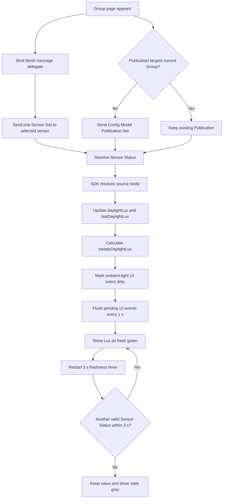

# Daylight Sensor 行显示 Lux 开发规划

## 1. 结论

本需求的目标、展示位置、两种视觉状态和大体数据来源已经明确，但还缺少几项会影响实现和验收的行为定义。建议按以下规则补全后再开发：

- 仅对当前 `UI Switch` 已稳定处于启用状态的 daylight sensor 展示并轮询 Lux；关闭、切换中或配置中不展示、不轮询。
- 轮询间隔采用项目内已有 Lux 读取页面的 `1 s`；每次发送 `Sensor Get (Present Ambient Light Level)`，不为本功能新增或修改 Sensor Publication。
- 收到目标传感器的有效 `Sensor Status` 即视为“数据有更新”，即使数值与上一次相同，也将 Lux 数值显示为绿色；`3 s` 内未再收到新状态则保留数值并变为灰色。
- Switch 刚启用时，如果 Node 已有 Lux 缓存，先以灰色展示；如果没有有效缓存，隐藏 Lux 与 `Sensor reading`，不显示 `0 lx` 或错误占位。
- 页面退出、进入帮助页、Switch 关闭、传感器进入 `.loading`、开始校准以及进入 Group member Configuring 时停止 App 轮询；流程结束并回到可交互页面后，根据当前 Switch 状态恢复。
- 校准管理器内部为校准采样所需的 Sensor 读取和临时 Publication 不属于本功能轮询，不能被停止。
- 数值采用 Group 页面相同的 `steadyDaylightLux`，而不是直接显示原始 `daylightLux`。

其中“同值回包也算更新”“1 s 轮询”“缓存值先灰显”“Manual Correction 期间继续轮询”属于建议规则，需要产品确认。

## 2. 当前工作区边界

当前 worktree 已存在用户改动：

- `LightSensorCalibrationViewController.swift` 已暂存 Calibration Mode/About 接入改动。
- `LightSensorCalibrationModeView.swift`、`LightSensorCalibrationAboutView.swift`、工程 target 配置和中英文文案存在配套改动。
- `docs/` 下已有 Calibration 调查与开发文档。

本功能应在这些改动之上做聚焦增量，不回退、不重排现有布局，不修改 SDK、依赖或无关模块。

## 3. Figma 设计核对结果

参考节点：

- 灰色状态：`519:14951`，`Sensor Row / ID002`
- 绿色状态：`533:17847`，`Sensor Row / ID002`

结构化设计信息给出的规则：

- 读数位于 Switch 左侧，右对齐，与 Switch 间距约 `6 pt`。
- 第一行是 `156 lx`，SF Pro Display Regular，`12 pt`。
- 第二行是 `Sensor reading`，SF Pro Display Light，`12 pt`。
- 灰态：数值与说明均为 `#94A3B8`。
- 新数据态：数值为 `#00D492`，说明仍为 `#94A3B8`。
- 设计标注要求：启用节点后由 App 轮询；退出页面或进入配置流程后停止轮询；本功能不配置节点上报。

实现时沿用现有 UIKit、SnapKit、`SCRXFrom` / `SCRYFrom` 和项目字体封装，不引入新图片或依赖。与当前 Group 页的胶囊背景样式不同，本页面以 Figma 的双行文字和文字颜色为准，只复用 Group 页的 freshness 语义和 `3 s` 计时规则。

## 4. 现有 Group 页面底部 Lux 获取与更新逻辑

### 4.1 获取来源

Group 页面出现时：

1. `GroupViewController.viewWillAppear` 找到 Group 当前绑定的 ambient light sensor。
2. 调用 `MeshAPI.getAmbientSensorValue(node:result:nil)`。
3. SDK 发送 `Sensor Get`，属性为 `Present Ambient Light Level`。
4. `viewDidAppear` 还会检查已绑定 sensor 的 Publication；如果没有发布到当前 Group，则补发 `Config Model Publication Set`。其 Period 为 disabled，因此代码本身没有配置周期性 Publication。
5. 后续 Group UI 可能收到两类同样的 `Sensor Status`：页面进入时主动 Get 的响应，以及 sensor 按设备/固件策略发布到 Group 的状态。

所以，Group 页面底部不是由一个持续的 App Lux 轮询 timer 驱动；它是“进入页面主动取一次 + 接收后续 Sensor Status”。文件中 `automationTimerAction` 的全 sensor 轮询属于测试/采集 Lux 文件流程，不是正常底部 UI 的数据源。

### 4.2 数据写入与平滑值

SDK 收到 `Sensor Status (0x52)` 后：

1. `MeshLibManager` 先按 source address 找到 Node。
2. `Node.updateNodeStatus` 解析 `Present Ambient Light Level`。
3. 旧值写入 `lastDaylightLux`，新值写入 `daylightLux`。
4. UI 读取 `steadyDaylightLux`。当前算法是：首次直接返回当前值；之后按 `1% 当前值 + 99% 上一次原始值` 计算。
5. Node 更新完成后，`MeshLibManagerMessageDelegate` 才收到消息回调，因此 Group 控制器读取到的是已更新缓存。

### 4.3 UI 刷新与颜色

1. `GroupViewController` 收到属于 Group sensor 的 `Sensor Status`。
2. 遍历 message 中全部 property；命中 `Present Ambient Light Level` 且 source 是当前 Group 绑定 sensor 时，将 ambient-light refresh event 标脏。
3. Group 控制器以 `1 s` UI refresh timer 合并消息并刷新，避免每个 Mesh 包都直接触发表格更新。
4. `GroupSensorView` 和对应 cell 读取 `steadyDaylightLux`，更新 Lux 文本并显示绿色背景。
5. 每次有效刷新都会重置 `3 s` timer；`3 s` 内没有新刷新时，仅把背景恢复为灰色，数值仍保留。
6. 初次用 Node 缓存构建 UI 时直接显示灰色，表示“有历史/当前缓存，但刚刚没有新消息”。

当前 Group 页的“绿色”判定是收到有效 Lux 消息，而不是比较新旧数字是否不同。这一点应作为新页面的默认行为，否则同一照度持续回包会一直错误显示为“无更新”。

### 4.4 流程图

## 5. 校准过程中是否暂停 Lux 更新

结论：需要暂停本功能新增的 App 轮询，并建议冻结行上的 freshness 状态为灰色；不能停止校准管理器自身的 Lux 采样。

原因：

- Figma 设计标注明确要求进入配置流程后停止轮询。
- `MeshSensorCalibrateManager` 会切换 Mesh transmitter、将 sensor 临时发布到本地节点、降低 publish delta，并监听该 source 的 `Sensor Status` 进行稳定性判断。
- 校准期间额外发送页面轮询 `Sensor Get`，其响应也可能进入同一 source/opcode 的监听链路，增加稳定性样本、Mesh 流量和时序干扰。
- 校准还会按多个亮度点等待并读取 Lux；并行轮询无法提高校准精度，反而让“哪次回包对应哪次采样”更难验证。

暂停边界建议：

- 点击 CALIBRATION 并完成输入/固件校验后，先停止页面轮询，再启动 `MeshSensorCalibrateManager`。
- Sensor 启用/禁用、切换 Publication、Group member Configuring 期间同样停止页面轮询。
- 校准失败后，只有用户关闭失败提示并回到普通页面时才恢复；Retry 保持暂停。
- Configuring 失败时，Retry 保持暂停；Cancel 后重新评估当前 Switch 状态并恢复。
- 成功完成全部 sensor enable、member Configuring 与 Auto restore 后恢复。
- Manual Correction 不属于校准状态机，建议保留轮询，使弹窗现有 Lux 同步更新；如果产品将其也视为配置流程，则需改为暂停。

## 6. 拟开发方案

### 阶段一：补充行 UI 与明确展示状态

修改 `LightSensorCalibrationSelectView.swift`：

- 在 cell 中增加右对齐的双行 Lux 区域，约束在 Switch 左侧，不改变现有 `40 pt` 行高。
- 缩短/限制设备名称可用宽度，避免长名称与 Lux/Switch 重叠；保留原 icon、校准绿点、loading 和 Switch 行为。
- 封装三种展示状态：hidden、stale gray、fresh green。
- fresh 状态启动/重置 `3 s` timer，超时变 stale；`prepareForReuse` 和状态隐藏时销毁 timer。
- `reloadSensorCell` 与 `cellForRowAt` 统一走同一套配置入口，避免 Switch 状态刷新时误清空或错误继承复用 cell 的 Lux。

### 阶段二：在控制器增加单一轮询所有权

修改 `LightSensorCalibrationViewController.swift`：

- 由控制器持有唯一 Lux polling timer，建议间隔 `1 s`；cell 只负责展示与 freshness，不负责发 Mesh 消息。
- 每次 tick 同时校验：页面可见、Mesh 已连接、没有独占操作、`selectSensor` 存在、该 Node 的 `selectState == .switchOn`、Ambient Light Sensor Model 存在。
- 使用现有 `MeshAPI.getAmbientSensorValue(node:result:nil)` 发送指定属性的 Sensor Get，数据更新统一走现有 `MeshLibManagerMessageDelegate`。
- 页面首次可轮询时立即发送一次，不等待第一个 timer 周期。
- 收到消息时按 source address 和 message 中任意 `Present Ambient Light Level` property 过滤；不要只检查 `values.first`。
- 使用 `steadyDaylightLux` 更新选择行，并继续更新现有 Manual Correction Lux。
- `viewWillAppear` 重新评估并启动；`viewWillDisappear` / `deinit` 停止。

### 阶段三：接入 Switch、校准和 Configuring 生命周期

- Switch 成功进入 `.switchOn` 后启动/切换轮询目标；旧 sensor 关闭或新 sensor 进入 `.loading` 时立即停止并隐藏旧行读数。
- 外接光感确认弹窗取消时不启动；确认后仍要等到 Node 真正进入可轮询状态。
- 为校准、sensor enable/disable、Group member Configuring 建立统一的“Lux polling suspended”状态，而不是在多个回调里零散操作 timer。
- 所有成功、失败、取消、Retry 和早退路径都重新计算轮询资格，避免 timer 永久停止或配置期间意外恢复。
- 只停止页面 timer；不修改 `MeshSensorCalibrateManager`、Sensor Publication、Group 路由或 SDK。

### 阶段四：国际化与验证

- 新增 `sensor_reading`：English 为 `Sensor reading`，简体中文建议为 `传感器读数`；`lx` 作为 SI 单位不翻译。
- 共享 View 已被四个品牌 target 引用，因此检查 `SunSmart`、`Archipelago`、`SLG Sync Plus`、`SylSmart` 的编译与资源可见性；无需新增 target/source 配置。
- 依次用 `iphoneos`、generic iOS device、`CODE_SIGNING_ALLOWED=NO` 构建四个 scheme，避免并行 DerivedData 锁冲突。
- 运行 `git diff --check`，并确认没有改动 SDK、依赖、无关资源或现有 Calibration Mode/About 逻辑。

## 7. 验收矩阵

| 场景 | 预期 UI | 预期 Mesh 行为 |
|---|---|---|
| 页面进入，Switch Off | 不显示 Lux | 不发送 Lux Sensor Get |
| 页面进入，Switch On，有缓存 | 立即灰显缓存 | 立即 Get，之后每 1 s Get |
| 页面进入，Switch On，无缓存 | 暂不显示 | 首个有效回包后显示 |
| 收到有效 Lux 回包 | 数值绿色，说明灰色 | 3 s freshness timer 重置 |
| 连续收到相同 Lux | 每次仍视为 fresh green | 不要求数值发生变化 |
| 3 s 无有效 Lux 回包 | 保留数值并变灰 | 轮询仍继续 |
| Mesh 断开 | 已有值变灰/保持，无新绿态 | tick 不发包；连接恢复后自动续发 |
| A 切换到 B | A 立即隐藏；B 成功 On 后显示 | 停 A，目标切到 B |
| Sensor `.loading` | 隐藏 Lux | 暂停轮询 |
| 开始校准 | 行读数冻结为灰色或被弹窗遮挡 | 页面轮询停止；校准器内部采样继续 |
| 校准/配置 Retry | 不恢复页面轮询 | 独占流程继续 |
| 校准/配置结束并回普通页 | 按当前 Switch 状态恢复 | 重新立即 Get |
| Manual Correction | 建议保持动态 Lux | 复用同一轮询与回包 |
| Push 帮助页或离开页面 | 不再更新 | timer 销毁，不再发 Get |
| 传感器超过 5 个并滚动复用 | 只有启用行显示正确状态 | 不因 cell 复用新增 timer |

自动化构建只能证明代码、target 和资源集成。以下仍需真机验证：实际 Sensor Get/Status 时序、断连恢复、校准期间是否完全没有额外页面 Get、固件 Publication 行为、长时间 Mesh 流量，以及双行文字在四品牌/中英文/长设备名下的视觉效果。

## 8. 待确认项

请确认以下建议后再实施：

1. 轮询间隔采用 `1 s`，绿色 freshness 采用 `3 s`。
2. “有更新”定义为收到有效 `Sensor Status`，即使 Lux 数字未变化也显示绿色。
3. Switch On 时优先灰显已有 `steadyDaylightLux`；没有值时整个读数区域隐藏。
4. 校准与 Configuring 全程暂停页面轮询，结束后恢复；Manual Correction 期间继续轮询。
5. 视觉以 Figma 双行文字为准，不照搬当前 Group 页绿色/灰色胶囊背景。

