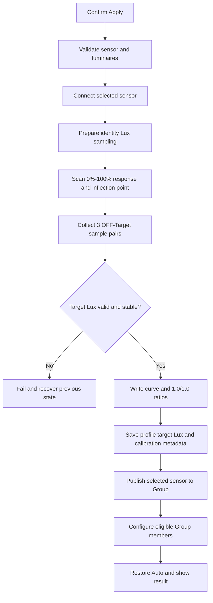

# Night Calibration 需求分析与开发规划

## 1. 分析结论

`Night Cal.` 的业务目标是合理的：在不使用外部照度计的前提下，以 daylight sensor 所在位置的 Lux 为反馈坐标，通过“目标亮度读数减去关灯环境底光”得到夜间目标照度，并把这个 Lux 目标配置到组内 Light LC 设备。环境光接近 0 lx 时，闭环稳定后的组亮度应接近用户选择的 `Target Night Brightness`；存在环境光时，灯具输出应下降，但维持的仍是目标 Lux，而不是固定亮度百分比。

当前需求可以进入技术验证和详细设计，但**还不适合直接进入完整业务开发**。主要原因不是 UI，而是以下协议和状态语义尚未闭合：

1. 现有 App/SDK 只能确认 `0x38` 保存灯具—传感器曲线、`0x39` 保存灯光/环境倍率，不能确认 firmware 在各阶段上报的是“原始硬件 Lux”还是“应用 `0x38/0x39` 后的 Lux”。
2. 产品要求“直接使用硬件 Lux”，但现有 Night 方案若在写入新 `0x38` 后再取样，取到的值可能已经不是原始坐标；这需要 firmware 给出准确公式和生效时机。
3. 产品已确认保持当前离线策略：仅在 Group 所有设备都离线时阻止校准，部分设备在线即允许继续。这个决策可实现，但部分灯具离线时得到的曲线只代表当时在线灯具；离线灯具恢复后实际光输出会改变，需作为已知产品风险和真机验收项。
4. `Target Night Brightness` 与 `Occupancy level` 不是同一个值。前者是校准取样时的亮度百分比，后者应保存计算后的 Lux C。
5. 只增加 `calibrationMode` 和 `targetNightBrightness` 两个字段，尚不足以完整表达“旧数据迁移、当前 sensor 身份、部分配置成功、重新校准失败、目标值后来被 Profile 修改”等状态。
6. `Sensor Cal.` 当前仍复用 Plane 页面，但需求同时要求成功后记录为 `sensorCal`，这会让持久化语义与真实算法不一致。

建议先完成本文第 11 节的产品/firmware 决策，再实施 Night Cal.。在这些决策成立后，App、NordicSigMeshSDK 和现有 Configuring 链路都具备可复用基础，整体技术上可行。

## 2. 对关键问题的直接回答

### 2.1 Target Night Brightness 是否同步给 Occupancy level

不直接同步。

- `targetNightBrightness = 50%` 表示校准时 App 把组调到 50% 亮度进行取样。
- App 读取三组目标亮度 Lux A 和关灯 Lux B，计算目标 Lux C。
- 对 `occupancy_daylight` / `vacancy_daylight`，应把 Lux C 写入 Profile 的 `occupancyLevel`。
- 对纯 `daylight` Profile，没有 Occupancy 阶段；若允许 Night Cal.，应把 Lux C 写入等价的恒照度字段 `taskLevel`。
- 最终组内灯具收到的是 Light LC `Ambient LuxLevel On`，不是 50% Lightness。

因此两个需要分别保存/使用的值是：

| 数据 | 单位 | 用途 |
| --- | --- | --- |
| `targetNightBrightness` | % | 记录校准取样亮度，并在完成页显示 `Set at x% brightness` |
| Profile `occupancyLevel` 或 `taskLevel` | lx | 运行时 Light LC 闭环目标，并在完成页显示 `Target level` |

#### 纯 Daylight Profile 的边界说明

这不是当前 `Night Cal.` 中已存在的另一个配置项。当前事实是：

- Calibration 入口同时对 `occupancy_daylight`、`vacancy_daylight` 和纯 `daylight` 三种 Profile 开放；
- 当前 `Night Cal.` 只有 mode/About 展示，没有任何 Night 校准、Lux C 计算或 Profile 写入业务；
- 前两类 Profile 有人/无人阶段，所以目标 Lux 字段是 `occupancyLevel`/L1；
- 纯 `daylight` Profile 没有人体感应和 Occupancy/L1，它持续维持的照度字段叫 `taskLevel`；
- 底层两者最终都会下发 Light LC `Ambient LuxLevel On`，因此协议上都可实现。

产品原始目标是“晚上感应到人”，该目标只直接对应 `occupancy_daylight` / `vacancy_daylight`。对纯 `daylight`，Night Cal. 只能理解为“持续维持目标 Lux”，不包含“感应到人”。为保持当前 Calibration 对三种 daylight Profile 的覆盖，本规划建议纯 `daylight` 也支持 Night，并把 Lux C 写入 `taskLevel`；如产品不希望扩大语义，则应在纯 `daylight` Profile 禁用 Night tab，而不能写入不会被运行时使用的 `occupancyLevel`。

### 2.2 Night Cal. 是否需要 Plane Cal. 的 ON/OFF 输入

不需要用户输入，也不应显示外部照度计输入组件。

Night Cal. 可以复用 Plane Cal. 的安装检测、0%/100% 以及拐点扫描，但倍率不应再通过外部 ON/OFF 照度计计算。若 firmware 定义确认使用传感器原始坐标，则 Night Cal. 的目标应是：

- `sensorRatio = 100`，即 1.0；
- `ambientLightRatio = 100`，即 1.0；
- `0x38` 仍使用现场扫描出的真实 Lightness—Lux 增量曲线；
- Profile 目标 Lux 使用校准得到的 Lux C。

不建议在内部伪造 Plane 页的 ON/OFF 输入再调用现有公式。直接把 Night 算法定义为 identity ratio 更清晰，也不会因不同轮次样本波动得到 99/101 等非预期倍率。

### 2.3 三次取平均是否合理

方向合理，但规则不完整。推荐明确为三个完整的 OFF→Target 配对周期：

1. 组关灯，等待稳定，读取 B1；
2. 组调到目标亮度，等待稳定，读取 A1；
3. 重复得到 B2/A2、B3/A3；
4. 计算每组差值 C1、C2、C3；
5. 产品若坚持平均值，则 `Lux C = round(mean(C1, C2, C3))`。

“分别平均 A/B 后相减”在数学上与等数量配对样本相同，但逐对差值更便于检测环境漂移和异常轮次。仅检查最终 Lux C 是否等于 0 不够，应至少满足：

- 每轮或有效轮次中 A 必须大于 B；
- Lux C 必须高于已确认的 sensor 噪声阈值，不能只要求 `> 0`；
- 三轮差值的离散程度不能超过阈值，否则判定环境/灯光未稳定；
- 所有计算先使用有符号或更宽类型，禁止 UInt16 直接相减导致下溢；
- 最终 Lux C 必须在当前 App/SDK 安全范围内。

若产品允许增强抗离群值能力，三次样本更适合取中位数；如果必须严格按原文取平均，则应保留上述稳定性校验。

## 3. 已确认的现有实现事实

### 3.1 Plane Cal. 当前做了什么

当前 `MeshSensorCalibrateManager` 已有以下能力：

1. 必要时直连 selected daylight sensor；
2. 发送 Vendor `0x36 / FFFF` 和 `0x39 / 100,100`；
3. 把 publish delta 临时设为 1，并把 Sensor Publication 指向本机；
4. 检查短时 Lux 稳定性；
5. 控制 Group 到 0%、25%、50%、75%、95%，再以 5% 步进寻找拐点；
6. 获取 100% Lux；
7. 发送 `0x38` 曲线；
8. 用外部照度计 ON/OFF 与 sensor ON/OFF 计算并发送 `0x39`；
9. 在 selected sensor 的 `sensorCalibrationData` 保存 ratio 和曲线；
10. 恢复 publish delta，再由 App 设置 Group Publication、逐设备 Configuring 和恢复 Auto。

因此 Night Cal. 不需要重写连接、灯控、Sensor Get、拐点扫描和 Configuring；需要在 SDK 中增加明确的 Night 分支和结果对象，而不是在 Controller 中拼接多段回调。

### 3.2 Lux C 如何下发到组内设备

对 daylight Profile，`Node.getNodeSyncProfiles()` 会把 Profile Lux 目标转换成 Light LC Property：

| Profile 数据 | 同步任务 | Light LC Property |
| --- | --- | --- |
| `occupancyLevel` | `occupancyLux` | Ambient LuxLevel On |
| `vacantLevel` | `vacantLux` | Ambient LuxLevel Prolong |
| `standbyLevel` | `standbyLux` | Ambient LuxLevel Standby |
| 纯 daylight 的 `taskLevel` | `occupancyLux` | Ambient LuxLevel On |

对应消息是 acknowledged `LightLCPropertySet`。因此“将目标照度更新给同组所有设备”的正确实现不是广播一个 Night 专用 Vendor 参数，而是：

1. 更新并保存 Group 的 Profile Lux；
2. 重新计算每个 Group member 的 profile 差异；
3. 对支持 Light LC Setup 的目标逐台发送现有 Lux Property；
4. 使用现有 Completed/Failed 机制记录结果；
5. 失败节点保留为待同步。

`0x38/0x39` 仍只写入 selected daylight sensor，不会复制给每台灯具。

### 3.3 Night 模式采用的 Lux 坐标

Night Cal. 把 Profile 目标定义为 sensor-coordinate Lux，而不是桌面/地面的工作面 Lux：

- 运行时目标数值表示 selected sensor 所在位置希望维持的照度；
- 环境光接近 0 时，该 Lux 对应校准时所选亮度附近；
- 有环境光时，灯具亮度会低于所选百分比；
- 更换 sensor、调整角度、改变灯具/房间反射条件后，需要重新校准；
- 不能宣称 `842 lx` 等于桌面真实 842 lx，除非另有照度计验证。

这与 Plane Cal. 的工作面坐标是两套不同的产品语义，必须通过 `calibrationMode` 明确区分。

## 4. 原始需求的合理性与缺口

| 需求项 | 判断 | 分析/补充 |
| --- | --- | --- |
| 使用 sensor Lux、不用照度计 | 合理但需 firmware 证明 | 必须确认 Sensor Status 在 `0x36/0x38/0x39` 各阶段的真实坐标 |
| 复用 Plane 安装检测和曲线 | 合理 | 现有 SDK 已具备大部分命令和扫描能力 |
| 0%/100% 自动形成曲线 | 基本合理 | 实际现有算法不只 0/100，还扫描最小拐点；不应降级为仅两点且忽略拐点 |
| OFF/Target 重复三次 | 合理但不完整 | 需定义顺序、稳定时间、噪声阈值、异常轮次和取整 |
| `Lux A - Lux B == 0` 才失败 | 不充分 | A < B、差值接近噪声、三轮波动过大都应失败 |
| 仅所有设备离线时阻止 | 产品已确认保持 | 部分设备在线即允许继续；部分灯具离线导致现场光输出不完整的风险作为真机验收项，不另外增加 preflight 拦截 |
| 更新 Occupancy level | 已闭合 | Occupancy 类 Profile 写 occupancyLevel；纯 daylight 写 taskLevel |
| 更新同组所有设备 | 可行 | 复用现有 per-node Light LC Configuring，不是把 sensor 曲线复制给灯具 |
| `targetNightBrightness` 默认 50% | 可行 | 需定义有效范围以及是否受 Low/High-end trim 约束 |
| Re-calibrate 仅切 UI | 合理 | 必须是页面会话态，不应点击即清除设备/数据库中的旧校准 |
| Night/Sensor 切换 sensor 不发命令 | 合理 | 建议所有模式统一为 draft selection，避免模式间行为不一致 |
| Sensor Cal. 先展示 Plane 页面 | UI 可临时复用，业务语义不完整 | 不应执行 Plane 算法后记录为 sensorCal |
| 部分失败 Cancel 后标记待同步 | 可行 | 需明确 Active 的含义，以及完成页是否显示 pending 状态 |

## 5. Figma 核对结果与设计冲突

本次通过 Figma 结构化设计读取核对了用户提供的全部关键节点。

### 5.1 与需求一致的设计

- Night 未校准页包含 `Target Night Brightness`，不包含 Plane ON/OFF 输入。
- 底部操作是 `APPLY NIGHT CAL.`。
- Apply 前有 `Apply Calibration?` 确认。
- 流程包含 `Connecting…`、`Calibrating…`、`Calculating target illuminance …`、`Configuring`。
- Configuring 展示 Completed、Failed 和进度，支持 STOP、失败后 RETRY/CANCEL、成功后 DONE。
- 完成页移除 Target Night Brightness，增加 `Calibration Complete`、`Target level`、`Set at x% brightness` 和 `Re-calibrate`。
- 完成页底部 Apply 呈禁用态。

### 5.2 必须修订或确认的设计内容

| Figma 内容 | 问题 | 建议口径 |
| --- | --- | --- |
| Night Complete 页仍显示 `Active: None` | 与成功状态冲突 | 应显示 `Active: Night Cal.` |
| 离线提示为 `cannot be deleted` | 复制了删除 Group 的旧文案 | 改成 calibration 专用文案，不出现 deleted |
| Apply 确认写 `selected sensor(s)` | 当前业务只允许单选 | 改成单数 sensor |
| Calibrating 标注只写 OFF/ON | 未说明 3 次，也未说明 0/100 曲线与 Target 取样的区别 | 交互稿补充两个阶段的准确任务 |
| 完成页注释一处写更新 L1，一处写 L1/L2 变化 | 自相矛盾 | 推荐只自动更新 Occupancy/L1，并提示用户检查 Vacant/L2 |
| 完成页正文写 Occupancy updated、review Vacant | 与“L1/L2 都变化”注释冲突 | 以正文为建议基线：自动更新 L1，不自动改 L2 |
| Target 示例为 27%，需求默认 50% | 示例与默认值不同 | 新 Profile/首次 Night 默认为 50%；示例数值不作为默认规则 |

完成页推荐文案语义是：“Occupancy level 已更新为目标 Lux，请检查 Vacant level 是否仍合适。”不要自动把 `vacantLevel` 也改成 Lux C，否则有人/无人阶段会失去差异。

## 6. 推荐的 Night Calibration 算法

### 6.1 前置条件

点击确认弹窗的 `APPLY` 后再执行以下检查：

1. 当前 Profile 是允许 Night Cal. 的 daylight Profile；
2. 已选择一个 draft daylight sensor；
3. sensor 支持现有 calibration 协议和最低 firmware；
4. 当前没有其他 calibration/configuration 会话；
5. Mesh/直连条件满足；
6. Group 不是所有设备都离线；按已确认的当前策略，部分设备在线即允许继续；
7. target brightness 在已确认的有效范围内；
8. Group 存在可参与日光闭环的 luminaire；不额外要求它们在 preflight 全部在线。如果实际只有 sensor 在线，OFF/Target 差值检查应导致目标获取失败，不保存新结果。

推荐把 `Target Night Brightness` 限制在有效灯光范围内：默认 50%，下限至少 1%，上限不高于 Profile High-end trim；若 Low-end trim/Auto minimum 会导致目标不可达，也应在开始前提示。是否严格使用 `[max(1, Low-end trim)...High-end trim]` 需要产品确认。

### 6.2 命令和计算阶段

推荐 SDK 执行顺序：

1. 连接 selected sensor；
2. 进入与原始 Lux 取样一致的 identity 状态；
3. 执行稳定性检查和现有拐点扫描，但先把曲线保存在内存；
4. 在写入最终 `0x38/0x39` 前完成三组 OFF→Target 取样；
5. 以每对 `A - B` 计算三个差值并做稳定性验证；
6. 目标 Lux 有效后，再写入现场 `0x38` 和 `0x39 = 100/100`；
7. SDK 返回结构化结果：曲线、ratio、三组原始样本、target Lux；
8. App 更新 Profile、选择的 sensor、模式元数据，再进入 Group Configuring。

第 2～6 步的先后最终必须以 firmware 对 `0x36/0x38/0x39` 的说明为准。如果发送 `0x36 FFFF` 本身会破坏旧曲线或改变 Sensor Status，就必须增加失败恢复方案，不能仅靠 App 延迟保存数据库来假装旧校准仍有效。

### 6.3 取样要求

- 使用 `Sensor Status` 中的原始 `daylightLux`，不能使用 UI 的 `steadyDaylightLux`；后者是 1% 当前值 + 99% 上一次原始值，会严重污染校准样本。
- 每次 Lightness 设置后应等待灯光和 sensor 稳定，不能固定认为 3 秒在所有灯具上都足够。
- 当前 Group Lightness 命令是 unacknowledged；建议增加至少一种到位证明：Lightness Status/readback、稳定 Lux 窗口，或经 firmware/设备验收确认的等待策略。
- 当前 `MeshAPI.getAmbientSensorValue` 先发 Sensor Get 再注册等待，并可能被同 source 的 unsolicited Publication 命中。Night Cal. 应使用由 calibration manager 独占、先注册后发送并绑定当前采样阶段的取样机制。
- 目标亮度取样期间页面的 1 秒 Lux 轮询必须暂停；当前代码已经具备暂停入口，应在新状态机中继续复用。

### 6.4 当前 All on/off 后是否等待 Lux 稳定

当前 SDK **有固定等待，但没有在每次 All off/on 后真正判定 Lux 已稳定**：

1. `getLightnessLuxData` 发送 Group Lightness 后固定等待 3 秒，然后只读一次 Sensor Lux；
2. Group Lightness 命令没有显式 transition time，设备可能按自身 Default Transition Time 渐变，固定 3 秒不能证明所有灯已到位；
3. SDK 确实有一个 3 秒 `stabilityVerify` 窗口，但它只在校准前检查当时环境的短时波动，不会在每个 OFF/Target 步骤后运行；
4. 该检查当前把“0 个上报样本”也当作稳定，不能作为 Night 取样的有效样本保障。

因此 Night 不应只复用“等 3 秒 + 单次读数”。建议每个 OFF/Target 采样点使用统一的 settling 策略：

1. 发送亮度命令后先等待最小渐变/响应时间；
2. 连续读取 Lux，要求至少 N 个有效样本；
3. 最近 N 个样本的极差或变化率连续满足已确认阈值，才记录本轮 A/B；
4. 超过硬超时仍不稳定则失败，不使用最后一次偶然读数；
5. 稳定窗口阈值和三轮 C 波动阈值分开定义。

N、最小等待、稳定窗口、硬超时、绝对 Lux 噪声阈值和相对波动阈值的数字仍需 firmware/sensor 精度和真机样本确认，不应在 App 中凭经验写死。

## 7. calibrationMode 与 targetNightBrightness 数据设计

### 7.1 不建议直接复用 UI enum

当前 `LightSensorCalibrationMode` 只有 night/sensor/plane，是页面选择 enum。持久化应新增独立 domain enum，包含：

- `none`
- `nightCal`
- `sensorCal`
- `planeCal`

raw value 必须固定，不能依赖 UISegmentedControl 顺序。UI 的顺序仍可保持 Night→Sensor→Plane。

### 7.2 两个字段的最小落地方案

如果产品确认只增加两个 Profile 属性，推荐：

- `storedCalibrationMode` 使用可空存储；空值表示旧版本未知，不能与显式 `none` 合并。
- `targetNightBrightness` 为整数百分比，首次 Night 默认 50；只在 Night sensor/target 阶段成功后保存，滑条拖动时只保存在页面 draft。

有效 Active 模式按以下规则计算：

| 条件 | Active |
| --- | --- |
| 没有有效 selected sensor，或 sensor 未校准 | None |
| selected sensor 已校准，旧记录没有 mode 字段 | Plane Cal. |
| selected sensor 已校准，存在明确 mode | 对应 mode |

这样可以满足“以前已校准 Group 默认 Plane Cal.”，同时区分新版本明确写入的 `none`。

### 7.3 两个字段仍未覆盖的边界

以下情况必须补充规则，必要时增加元数据对象，而不是继续堆布尔值：

1. **sensor 切换**：Profile 上的 Night mode 可能属于旧 sensor。至少应把 mode 与 selected sensor address 绑定，或在切换已有校准 sensor 时降级为可解释的 Plane legacy 状态。
2. **部分配置成功**：sensor 已完成 Night 校准，但部分灯具未收到 Lux 目标；单一 Active mode 无法表达 pending。
3. **Profile 后续修改**：用户改了 Occupancy Lux 后，完成页当前 Target level 会变化，而 `Set at x%` 仍来自旧校准。需明确这是“当前目标 + 历史取样亮度”，还是保存独立 calibratedTargetLux 快照。
4. **重新校准失败**：device 可能已被 `0x36/0x38/0x39` 部分修改；仅保留旧 mode 会谎报健康，直接设 none 又会丢失可恢复信息。
5. **Profile 类型切换**：daylight→非 daylight 必须清 mode/selected sensor；不同 daylight 类型间切换要定义是否保留 Night metadata。

更健康的数据形态是 Group/selected-sensor 关联的 `DaylightCalibrationMetadata`，至少包含 mode、sensorAddress、targetNightBrightness、targetLux、同步状态或 revision。若本阶段必须严格控制为两个字段，则要接受上述降级规则并写入验收说明。

### 7.4 持久化影响范围

若属性按需求存入 `Profile`，必须同步覆盖：

- `Profile` 初始化、copy、updateData、equality；
- SQLite `profiles` 表建表与旧表增列迁移；
- load/save；
- Group export/import JSON；
- Profile 类型切换和 Group 删除/换 sensor 清理；
- 四品牌共享 target；
- 旧版本缺字段兼容。

只改 Model 内存属性会导致重启、导入或编辑 Profile 后丢失 Active 状态。

### 7.5 云端上传与回读

产品已确认 `calibrationMode` 和 `targetNightBrightness` 必须支持上传云端以及从云端同步到 App。当前 Group/Profile 的云数据位于 `spaceprops.groups[].profile`，因此建议直接增加：

| JSON 字段 | 类型 | 示例 | 兼容规则 |
| --- | --- | --- | --- |
| `calibrationMode` | String | `nightCal` | 仅接受 `none/nightCal/sensorCal/planeCal`；未知值按安全兼容规则降级，不崩溃 |
| `targetNightBrightness` | Int | `50` | 缺失时使用 50；导入时校验范围，不盲目使用异常值 |

完整链路是：

1. Night/Plane 真正成功后，一次性更新 Profile 和本地 SQLite；页面浏览、tab 切换、sensor draft 或拖动 brightness 时不标记云变更；
2. 推进当前 Space 的 `lastUpdate`，并通过现有 `spaceDataChangedNotificaitonName` / `commitLocalChangeForCloudSync` 进入云同步队列；
3. Space export 把两个字段带入 `groups[].profile`，上传到 `/sitespace/sync/spaceprops`；
4. `/sitespace/get/spaceprops` 回读后，Group/Profile import 解析字段并保存本地；
5. 延续当前 Space `updateTimestamp` 冲突规则：远端较新时才覆盖 Owner/Editor 的已有本地数据，本地待上传不应被较旧回包覆盖。

旧版云数据缺少 `calibrationMode` 时，不能无条件当作 `planeCal`：导入完 Group、selected sensor 和 sensor calibration data 后，如 selected sensor 存在有效旧校准数据则视为 `planeCal`，否则是 `none`。这个 legacy 判定应放在组装完整 Group 数据后执行，不能只看 Profile JSON。

云端是否对 `profile` 子字段做白名单过滤，无法仅由 App 代码证明。上线前需要完成真实 Server 往返验收：App A 上传 → 服务端保存 → App B/重装 App 回读，并核对两个字段、Active 和完成页。若服务端存在 schema 白名单，则该服务端改动是 Night 上线的前置依赖。

## 8. UI 状态规则

页面状态应由四个相互独立的维度组合，而不是只看 segmented control：

1. 当前浏览模式；
2. 已落地 Active 模式；
3. 当前页面 draft sensor/brightness；
4. operation state：idle、connecting、calibrating、calculating、configuring、partial、success、failure。

### 8.1 Night 未校准/准备重新校准

- 显示 About Night Cal.；
- 显示 Target Night Brightness；
- 隐藏 Plane ON/OFF Calibration Point；
- 隐藏 Manual Correction，除非产品明确允许对 Night identity ratio 修改；推荐 Night 下隐藏，避免破坏 1.0/1.0 语义；
- 底部显示 `APPLY NIGHT CAL.`；
- 无 draft sensor 时禁用；
- 点击先显示确认，只有 APPLY 才进入 preflight 和 calibration。

### 8.2 Night 已完成

当“当前浏览 Night + Active Night + 非 session recalibration”时：

- 移除 Target Night Brightness；
- 显示 Calibration Complete；
- Target level 显示当前 Profile 的 Occupancy Lux；纯 daylight 若支持则显示 Task Lux；
- Set at 显示已保存 targetNightBrightness；
- 显示 Profile 更新提示；
- 显示 Re-calibrate；
- 底部 Apply 禁用；
- Active 必须显示 Night Cal.。

点击 Re-calibrate 只设置页面会话态：

- 本页面立即切回 Night 未校准 UI；
- 不清数据库，不发 Mesh 命令，不改变 Active；
- 未 APPLY 就退出，重新进入仍显示已完成；
- APPLY 后才可能替换旧结果。

### 8.3 模式切换

- Active 文案永远来自已落地状态，不跟随当前浏览 tab。
- Active Plane 时切到 Night，应显示 Night 未校准页，可开始 Night Cal.。
- Active Night 时切到 Plane，应显示 Plane 页面；Plane 成功后 Active 才变 Plane。
- Re-calibrate 是 Night tab 的 session 状态；切走再切回是否保留，建议页面生命周期内保留，退出页面后清除。

### 8.4 Sensor Cal. 当前阶段

产品已确认本阶段：

- `About Sensor Cal.` 保持当前 UI 、英文文案、结构和切换行为，不修改；
- Sensor tab 仍展示当前复用的 Plane 业务页面；
- Sensor Cal. 未实现前不保存 `sensorCal`；
- 若 Sensor tab 临时允许执行现有 Plane 流程，成功结果只能标记为 `planeCal`。

## 9. Daylight sensor 开关行为

建议 Plane、Night、未来 Sensor 三种模式统一改为 draft selection：

- 页面 Switch 只修改本页 draft selected sensor；
- 启用 draft sensor 后可以按当前 Figma 标注进行 App 轮询，但不设置/取消 Sensor Publication，不配置灯具；
- 用户点击对应 APPLY/CALIBRATION 并确认后才提交；
- 流程成功后再更新 `ambientLightSensorNodeAddress`、Publication 和 Group member 配置；
- 未提交退出时恢复已落地 sensor 的显示。

这样比“Plane 立即发命令、Night/Sensor 不发命令”更一致，也能避免用户只浏览页面就改变正在运行的 Lux 路由。

但这会改变 Plane 的既有行为，属于需要明确批准的兼容性改动。若本阶段采用最小范围方案，可以先只让 Night 使用 draft selection，Plane 保持现状；代价是 mode 切换、轮询所有权和退出恢复会更复杂，后续仍需统一。

## 10. 失败、回滚与 Active 语义

### 10.1 建议的成功分层

| 层级 | 证明内容 |
| --- | --- |
| Sensor calibrated | selected sensor 的 Night 曲线、ratio 和 target sample 有效 |
| Profile saved | Lux C 和 targetNightBrightness 已持久化 |
| Sensor routed | selected sensor Publication 指向当前 Group |
| Group configured | 所有 eligible device 的 pending tasks 成功 |
| Runtime healthy | 真机闭环在人员触发、环境变化和断电恢复后符合预期 |

`calibrationMode` 最多只能表达第一/二层，不能等同于整组完全健康。Active 的产品定义应明确为“当前 selected sensor 使用的校准算法”，Configuring/pending 另行表达。

### 10.2 目标照度获取失败

以下任一条件进入专用 failure：

- 任一必要 Sensor Get 超时；
- target 平均不大于 off 平均；
- Lux C 不高于噪声阈值；
- 三轮差值不稳定；
- 数值超出可保存/下发范围；
- 灯具在取样中离线或未到目标输出。

Retry 应从已定义的安全检查点重新开始，不应在未知的部分写入状态上继续累加。Cancel 应执行恢复/清理后返回页面。

### 10.3 重新校准失败

当前 SDK 失败路径会清空 `sensorCalibrationData` 并关闭 Publication，且 `0x38/0x39` 没有 GET readback；这意味着“失败时继续显示旧 Active Night”并不可靠。

推荐规则：

- 开始前保存旧 sensorCalibrationData、selected sensor、Profile target 和 mode；
- 只有在 firmware 证明旧 `0x38/0x39` 可以完整重写恢复时，失败后才允许回滚并保留旧 Active；
- 回滚失败或旧数据不完整时，设置 Active None、关闭 Light Auto Adjust，并保留明确待修复状态；
- 不允许数据库显示旧 Night，而 device 已处于 reset/partial curve。

这是当前需求中最高优先级的健康性问题。

### 10.4 Configuring 部分成功

- RETRY 只重算并重试 failed/pending nodes；
- CANCEL 不回滚已成功节点，也不回滚 sensor calibration；
- failed nodes 必须保持 `needSync`；
- 本地 Profile Lux 和 calibration metadata 保留；
- 页面需明确“Night calibration 已保存，但部分设备待同步”，否则 Active Night 容易被误解为全组完成；
- 全部成功后再恢复 Group Auto，并显示 Success/DONE。

当前 Configuring 逻辑可复用，但需要把完成回调从单一 Bool 扩展成 allSuccess/partial/cancelled，避免 partial 弹窗出现前就把流程当作最终失败处理。

## 11. 开发前必须确认的决策

| 编号 | 待确认项 | 推荐答案 |
| --- | --- | --- |
| D1 | Night Cal. 是否支持纯 `daylight` Profile | **已确认支持**：保持现有三种 daylight Profile 覆盖，Lux C 写入 taskLevel |
| D2 | 自动修改哪些 Profile level | **已确认**：只改 Occupancy/L1；不改 Vacant/L2，完成页提示检查 Vacant |
| D3 | target brightness 有效范围 | 默认 50%，限制在实际可达 trim 范围，禁止 0% |
| D4 | 校准允许部分灯具离线吗 | **已确认允许**；保持当前“仅 Group 所有设备离线才阻止”的策略 |
| D5 | 三次结果使用平均还是中位数 | **已确认**：使用三组 OFF→Target 配对差值的平均，并增加稳定性/噪声校验 |
| D6 | Lux C 最小有效阈值和三轮波动阈值 | 由 sensor 精度和 firmware 团队给出，不只判断 0 |
| D7 | Sensor Status 在 `0x36/0x38/0x39` 前后的公式 | **已确认**：Night 使用真实 0x38 曲线与 0x39=100/100，但 firmware 公式验证是 SDK 上线前置 |
| D8 | 重新校准失败的旧值恢复策略 | **已确认**：能完整回滚才保留旧 Active，否则 None + 关闭 auto |
| D9 | Active 是否代表 sensor calibration 还是全组同步完成 | **已确认**：代表校准算法；另显示 pending configuration |
| D10 | Plane sensor Switch 是否也改为提交时生效 | **已确认**：最终统一 draft selection；为降低 Plane 回归风险可拆为独立阶段 |
| D11 | Sensor Cal. 临时行为 | **已确认**：保持 About Sensor Cal. 现状，未实现前不保存 sensorCal |
| D12 | 完成页 Target level 后续随 Profile 修改是否变化 | 推荐显示当前 Profile target，并把 Set at 定义为历史校准参考 |

## 12. 推荐开发阶段

### 阶段 0：Firmware/真机协议验证

- 获取 `0x36/0x38/0x39` 的 firmware 计算公式、生效顺序、NVM 和 Sensor Status 坐标说明；
- 用固定环境做 reset、写 curve、写 100/100 前后的多亮度 A/B 对比；
- 验证断电恢复；
- 验证 Group Lightness 到位时间、最小非零输出和 sensor 噪声；
- 确认校准失败可否可靠回滚。

输出应是可以作为 SDK fixture 的命令/样本表。未完成该阶段，只能开发 UI 和纯计算，不能声称闭环可用。

### 阶段 1：数据模型与兼容迁移

- 增加独立 domain calibration mode；
- 增加 Profile 持久化字段及 legacy nullable migration；
- 完成 copy/update/equality、SQLite、Group/Profile export/import；
- 把字段纳入 `spaceprops.groups[].profile`，接入 Space dirty marker 和云同步队列；
- 定义 Profile type/sensor switch 清理规则；
- 增加旧 calibrated group→Plane 的迁移测试；
- 与后端确认新字段不被 schema/白名单过滤，完成跨 App/重装回读验收。

### 阶段 2：SDK Night 状态机

- 在本地 NordicSigMeshSDK 中扩展 calibration manager；
- 复用连接、stability、curve scan；
- 增加三组配对采样、纯计算结果和专用 progress/error；
- 使取样与页面轮询、unsolicited Publication 隔离；
- 增加 reset/rollback/cleanup；
- 扩展 `SensorCalibrateMathTests` 覆盖下溢、0、噪声、平均、波动、边界和取整。

### 阶段 3：Night UI 与页面状态

- 增加 Target Night Brightness 卡片；
- 增加 Calibration Complete 卡片；
- 按 mode 切换 Plane/Night 内容；
- 接入 Apply confirmation、session-only Re-calibrate、按钮 enablement；
- 修正 Figma 冲突文案并完成英文/简体中文国际化；
- 在当前 Lux polling 代码之上接入新的 operation suspension，不回退现有行为。

### 阶段 4：Profile 更新与 Group Configuring

- Night SDK success 后更新正确的 Profile Lux 字段；
- 保存 targetNightBrightness 和 mode；
- 标记 Space 本地变更并触发现有 CloudSynchronizationManager 上传；
- 设置 selected sensor Publication；
- 逐节点同步 Lux/订阅/Auto Adjust；
- 实现 partial retry、cancel→pending、success→DONE；
- 全成功后恢复 Auto；
- 完成页根据真实状态刷新。

### 阶段 5：Plane 行为统一与回归

- 按已确认决定统一 draft sensor selection，或保留 Plane 既有即时切换；
- Plane 成功写 planeCal；
- 旧数据 migration 后显示 Plane；
- Sensor placeholder 不写入虚假的 sensorCal；
- 回归 Manual Correction、sensor switch、取消 Publication、Group 删除/换 Profile。

## 13. 预计修改范围

### App

- `LightSensorCalibrationViewController.swift`
- `LightSensorCalibrationModeView.swift`
- `LightSensorCalibrationAboutView.swift`
- `LightSensorCalibrationSelectView.swift`（基于当前 Lux polling 行为继续开发）
- 新增 Target Night Brightness / Calibration Complete 局部 View
- `Profile.swift`
- `Database.swift`
- `ExportData.swift`
- `ImportData.swift`
- `Node+SyncData.swift`（仅在需要显式 pending/强制目标同步时调整）
- 英文、简体中文 `Localizable.strings`
- 新增文件的四 target membership

### NordicSigMeshSDK

- `MeshSensorCalibrateManager.swift` 或拆分出的 Night calibration coordinator
- 必要的 calibration result/progress/error 类型
- `SensorCalibrateMathTests.swift` 及新增状态机/消息测试

当前工程已经引用本地 SDK `/Users/maginawin/Developer/iOS/YKH/nordic-sig-mesh-sdk`，SDK 分支为 `timezone`，分析时提交为 `cf1d0a7`。

## 14. 验证与验收计划

### 14.1 自动验证

- calibration math 单元测试；
- Profile legacy/new 数据 load-save、copy、update、equality、export-import round trip；
- UI state reducer 测试：Active 与 selected tab 分离、Re-calibrate session、按钮状态；
- partial Retry 只包含 failed nodes；
- `git diff --check`；
- 按项目规则串行执行四个 iPhoneOS generic build：SunSmart、Archipelago、SLG Sync Plus、SylSmart。

### 14.2 真机验收矩阵

| 场景 | 关键证据 | 通过条件 |
| --- | --- | --- |
| 0 lx 夜间环境 | 三组 A/B、Lux C、最终亮度 | 闭环 target Lux 稳定，亮度接近 target brightness |
| 有稳定环境光 | 校准样本与运行 Lux | 灯光贡献下降，总 Lux 维持目标 |
| 环境光缓慢变化 | Lux/Lightness 时间序列 | 无明显振荡、闪烁或长期饱和 |
| sensor 位置不当 | A/B 差值 | 低于阈值时明确失败，不保存 mode |
| 一台灯离线 | preflight、三轮 A/B、完成后闭环 | 按产品决策允许开始；记录部分灯具离线时的目标差异，恢复后验证是否需要重新校准 |
| 所有 Group 设备离线 | offline dialog、Retry | 禁止开始；Retry 重新检查，任一设备恢复在线后才可继续 |
| 灯具渐变超过 3 秒 | Lightness/Lux 时序 | 不在渐变中提前采样；达到稳定窗口后才记录 A/B，超时则失败 |
| target brightness 边界 | trim、Lightness、Lux | 禁止不可达值，取样与运行范围一致 |
| 首次 calibration 失败 | device/local/profile/publication | Active None，Auto/Publication 状态一致 |
| Re-calibration 失败 | 旧/新 curve、mode、target | 按确认的 rollback 规则完全一致，无假 Active |
| Configuring 部分失败 | 成功/失败节点、pending | 成功不回滚，失败可重试，Cancel 后仍待同步 |
| 断电恢复 | sensor ratio/curve、Light LC target | 重启后恢复 Night 闭环 |
| Profile 修改 target | 完成页与设备 readback | 当前 Target level、pending 和 Set at 语义一致 |
| Cloud 往返 | App A 上传、服务端回包、App B/重装回读 | mode、targetNightBrightness、Active 和完成页一致，新字段未被服务端过滤 |
| 四品牌 | UI、本地化、命令 | 编译一致，主题正确，无 target 漏文件 |

自动测试和 iOS 构建不能证明真实 BLE 连接、Mesh 命令到达、firmware NVM、sensor 原始 Lux、灯光到位时间、闭环稳定性和真实人员感应。最终验收必须包含抓包、设备 readback、外部照度计旁路记录和断电测试；外部照度计在这里用于工程验收，不是用户操作流程的一部分。

## 15. 当前工作区边界

本轮已按确认结论修改 SunSmart App 与本地 NordicSigMeshSDK，并补充契约检查、SDK 数学测试和本实施文档。改动只覆盖 Daylight Profile 持久化/云同步、Group Calibration、Night 稳定取样与失败回滚、相关中英文文案；没有修改无关业务、target 配置或依赖版本，也没有执行 Git 暂存、提交或推送。

## 16. 已确认结论

以下产品基线均已确认，并作为本轮实现依据：

1. Target Night Brightness 只是取样百分比；Lux C 才写入 Occupancy/L1。
2. 不自动修改 Vacant/L2，只在完成页提醒检查。
3. 纯 daylight 没有 Occupancy/L1；它的等价恒照度字段是 taskLevel。产品已确认 Night 支持纯 daylight，Lux C 写入 taskLevel。
4. 保持当前离线策略：仅 Group 所有设备离线时不允许校准，部分设备在线即允许继续。
5. 三组 OFF→Target 配对取平均，并增加噪声和波动阈值。
6. Night 使用真实 `0x38` 曲线和 `0x39 = 100/100`，但以 firmware 公式验证通过为前置条件。
7. Re-calibrate 点击本身不改设备；真正失败时按“可完整回滚才保留旧 Active”的规则处理。
8. Active 表示校准算法，不表示所有 Group member 已同步；partial/pending 另行展示。
9. Sensor Cal. 未实现前不保存 sensorCal。
10. sensor Switch 最终统一为 draft selection；若担心 Plane 回归，可拆成后续独立阶段。
11. `About Sensor Cal.` 保持现状，不修改 UI 和文案。
12. `calibrationMode` 和 `targetNightBrightness` 同步写入 Cloud spaceprops，并支持云端回读、旧数据兼容和 Server 往返验收。
13. Night 每个 OFF/Target 点必须在灯具渐变和 Lux 稳定后取样；不沿用当前“固定等待 3 秒后单次读数”作为稳定证明。

## 17. 2026-08-21 阶段实施结果

### 17.1 App 数据与云同步

- Daylight Profile 新增 `calibrationMode` 与 `targetNightBrightness`，默认取样亮度为 50%。
- 新数据明确保存 `none`、`nightCal`、`planeCal`；旧数据缺少字段时，根据已有 sensor calibration 状态兼容为 Plane 或 None。
- Database、Profile copy/equality、Space export/import 均已覆盖两个新字段，因此具备上传 Cloud spaceprops 与从云端恢复到 App 的客户端链路。
- `Active` 只表示 Profile 当前生效的校准算法；Configuring 未同步设备数在 Night 完成卡片中另行显示。
- Night 成功后，带 occupancy 的 Daylight Profile 将 Lux C 写入 `occupancyLevel`；纯 daylight 将 Lux C 写入 `taskLevel`。不自动修改 Vacant/L2。

### 17.2 Night UI 与交互

- 按 Figma 节点实现 Night 未校准页、Target Night Brightness、Apply 二次确认、Connecting、Calibrating、Calculating target illuminance、失败提示、Configuring 和完成卡片。
- Target Night Brightness 默认 50%，可选范围限制在当前 Profile 的 Low/High-end trim 可达范围内，且禁止 0%。
- 未选择 daylight sensor 时禁用 `APPLY NIGHT CAL.`；Group 所有设备离线时阻止开始，Retry 会重新检查，部分设备在线仍按已确认规则允许开始。
- 校准完成后移除 Target Night Brightness，显示当前 Target level、历史 `Set at x% brightness`、pending 数量和 Re-calibrate。
- Re-calibrate 只改变当前页面会话状态；退出再进入仍以已保存的 Night Active 展示完成页，点击本身不修改设备或 Profile。
- Night 与 Sensor 页的 sensor switch 仅修改 draft selection，真正 Apply 时才提交。Plane 暂时保持原行为，统一 draft selection 留作独立回归阶段。
- Sensor Cal. 仍复用现有 Plane 业务页，`About Sensor Cal.` 的 UI、文案与路由保持不变；当前阶段不会保存 `sensorCal`。

### 17.3 SDK 曲线、稳定取样与回滚

- Night 复用 Plane 的连接、安装检查和真实 `0x38` 曲线生成流程，随后写入 `0x39 = 100/100`。
- 目标照度按三组 `OFF → Target` 配对采集，逐组计算正差，再对三组 Lux 差值取平均得到 Lux C。
- 每次 All OFF/Target 后不会立即读取单个 Lux：先等待最小稳定时间，再主动连续发送 Sensor Get；最近窗口满足稳定范围才接受本轮值，超时则失败。页面原有 Lux 轮询在校准期间继续暂停。
- Sensor Get 的响应监听已调整为先注册、后发送，降低快速响应丢失和阶段取样竞争风险。
- 开始校准前保存旧曲线、倍率和 publication。失败时尝试完整写回；只有完整回滚成功才保留旧 Active，无法完整回滚时返回专用错误，由 App 保存 None 并关闭 auto。
- draft sensor 提交失败时同时恢复所选 sensor 校准前的 `0x38/0x39`、所选 sensor 原 publication，以及原 Group sensor publication。两部分都成功才保留旧 Active；任一部分无法证明恢复完整时保存 None 并关闭 Group auto。

当前 SDK 默认参数如下。这些值复用现有 SDK 判断，且已设计为可注入 policy，属于 firmware/真机验收前的暂定默认值，不是所有 sensor 型号的最终产品规格：

| 参数 | 暂定默认值 |
| --- | --- |
| OFF→Target 配对数 | 3 组 |
| 每个亮度点最小等待 | 3 秒 |
| Sensor Get 间隔 | 0.5 秒 |
| 单点稳定超时 | 15 秒 |
| 稳定窗口 | 最近 3 个有效 Lux |
| 窗口最大极差 | 10 lux |
| 单组最小正差 | 2 lux |
| 三组差值最大极差 | 10 lux |
| 相对波动阈值 | 暂未启用，等待设备规格 |

### 17.4 自动验证结果

- Night Profile 持久化/云字段契约检查通过。
- Night 工作流、纯 daylight→taskLevel、Sensor Cal. 不保存 sensorCal 等契约检查通过。
- App 与本地 NordicSigMeshSDK 的 `git diff --check` 通过。
- SunSmart、Archipelago、SLG Sync Plus、SylSmart 四个 scheme 均使用 iPhoneOS generic destination、关闭签名构建成功。
- SDK 新增稳定窗口、配对平均、无效正差和波动拒绝的数学测试；但该 Package 现有代码直接引入 UIKit，macOS `swift test` 无法完成编译。四个 App iPhoneOS 构建已覆盖 SDK 的 iOS 编译，不等价于执行这些单元测试。

### 17.5 上线前仍需完成的外部验收

- firmware 确认 `0x36/0x38/0x39` 公式、写入生效顺序、NVM 行为，以及 Night 取样获得的是预期 Lux 坐标。
- 依据各 sensor 型号精度与真实渐变数据确认或下发上述 policy 数字，尤其是 3 秒、10 lux、2 lux 和 15 秒。
- 使用真实设备验证 All OFF/Target 的渐变稳定、三轮样本、完整回滚、publication 切换、部分设备离线和断电恢复。
- 验证服务端没有过滤新增 spaceprops 字段，并完成跨设备/重装 Cloud 往返。
- 验证人体感应后的 Light LC 闭环确实稳定维持 Occupancy/task Lux；自动构建不能证明 BLE/Mesh 命令到达、firmware 计算或真实照明效果。
- 进行四品牌真机 UI/主题/弹窗/手势视觉验收；本轮仅完成结构化 Figma 对照与编译验证。
